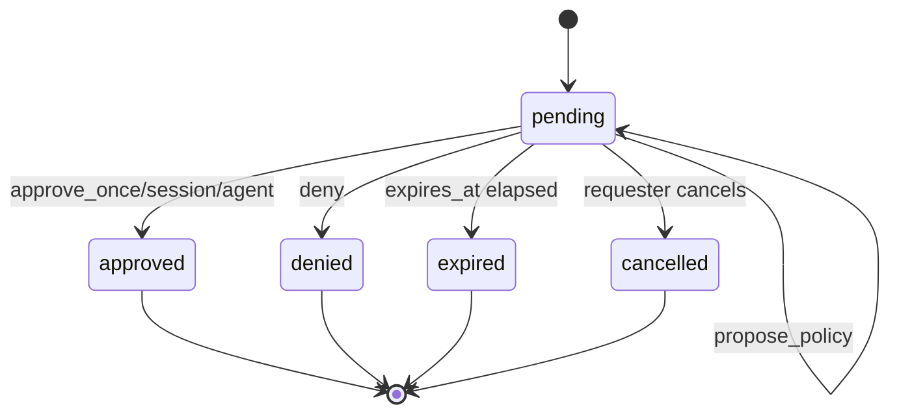

# Advanced Approval Actions

## Purpose

Advanced approval actions expand Hermes Mobile Control Plane beyond binary approve/deny decisions while preserving fail-closed behavior.

The operator should be able to ask for more information, modify the action, partially approve a safer subset, escalate into TUA or TUI, or stop work entirely.

## UX Model

Approval cards expose three primary buttons:

- Approve
- Deny
- More

The More menu includes:

- Approve Once
- Approve For Session
- Approve For Agent
- Approve Forever
- Other
- More Info
- Open TUA Session
- Open TUI Session
- Browser Assistance
- Pause Agent
- Stop Task
- Stop Agent

## Decision Types

| Decision Type | Meaning | Terminal State |
| --- | --- | --- |
| `approve_once` | Approves this single action | yes |
| `approve_session` | Approves under session scope | yes |
| `approve_agent` | Approves under agent scope | yes |
| `deny` | Denies requested action | yes |
| `modified` | Returns alternate instructions, replacement action, partial approval, or constraints | no, until Hermes evaluates result |
| `needs_info` | User asks for more information | no |
| `propose_policy` | Creates an Approve Forever proposal only | no |

## Approval State Model

Existing durable states remain useful for terminal records:

- `pending`
- `approved`
- `denied`
- `expired`
- `cancelled`

For richer UX, approval responses carry more specific decision metadata:

- `approve_once`
- `approve_session`
- `approve_agent`
- `deny`
- `modified`
- `needs_info`
- `propose_policy`

The gateway may store these as either expanded approval states or as `ApprovalResponse.decision_type` values. The preferred design is to keep `ApprovalRequest.state` compact and put the richer user intent in `ApprovalResponse`.

## ApprovalResponse Object

Required fields:

- `approval_response_id`
- `approval_id`
- `decision_type`
- `created_by_device_id`
- `created_at`

Optional fields:

- `user_message`
- `replacement_action`
- `constraints`
- `approved_scope`
- `policy_created`
- `expires_at`
- `assistance_session_id`
- `terminal_session_id`

## Constraints

Constraints are user-provided safety boundaries. Examples:

- only this directory
- read-only first
- do not touch auth
- ask again before writing
- only run tests
- only approve listed tools

Constraints must be visible to Hermes, policy evaluation, mobile history, and audit logs. If Hermes cannot enforce a constraint, the requested action remains blocked until the gateway or user resolves the conflict.

## Approve Forever

Approve Forever is a policy action, not a normal approval shortcut.

Requirements:

- Show risky warning.
- Require second confirmation screen.
- Create or propose an `ApprovalPolicy` record.
- Audit the policy decision or proposal.
- Never be default for high or critical risk actions.
- Be revocable from agent or policy settings.

Critical risk actions should default to one-time approval unless an explicit policy allows otherwise.

## Other

Other lets the user respond with a safer instruction instead of the requested action.

Supported response shapes:

- alternate instruction
- partial approval
- replacement action
- one or more constraints

Examples:

- "Run tests only; do not commit."
- "Read the file first, then ask again before editing."
- "Only delete files under `build/`."
- "Use `git status` and summarize before pushing."

## More Info

More Info is a clarification action, not an approval.

Requirements:

- Show friendly summary first.
- Allow technical drill-down.
- Allow TUA interaction.
- Show raw redacted payload only after explicit expand.
- Keep the original approval pending unless it expires or is cancelled.

## Audit Requirements

Audit events must include:

- approval ID
- decision type
- approved scope if any
- policy creation/proposal flag
- constraint summary
- linked TUA or TUI session IDs if any
- deciding device ID
- node, agent, and session context

Raw replacement actions and user messages must be redacted where policy requires.

## Planned API Surface

- `POST /v1/approvals/{approval_id}/responses`
- `GET /v1/approvals/{approval_id}/policy-proposals`

Future policy activation APIs remain planned:

- `GET /v1/approval-policies`
- `POST /v1/approval-policies`
- `DELETE /v1/approval-policies/{approval_policy_id}`
