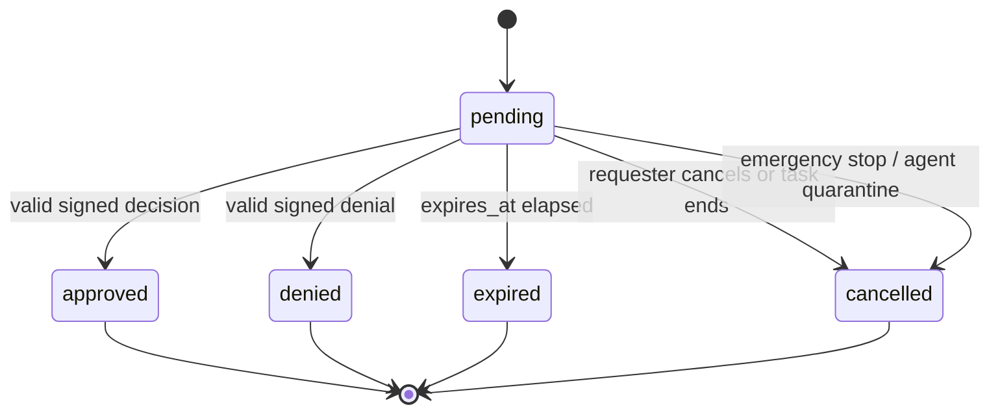
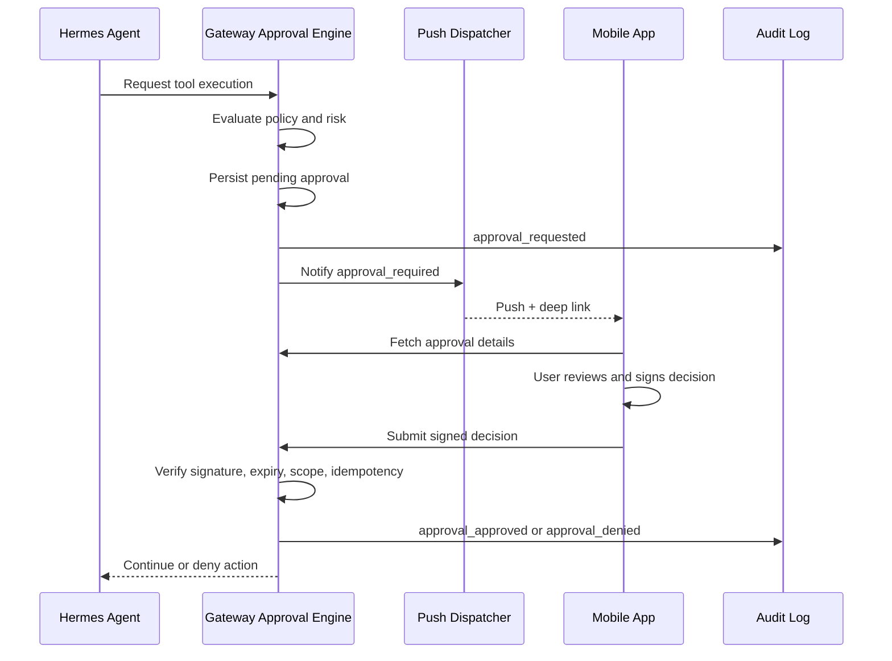
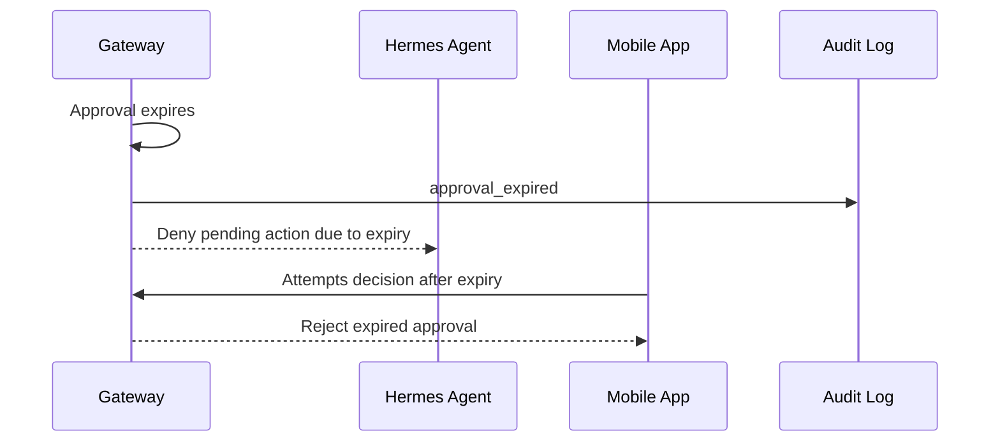
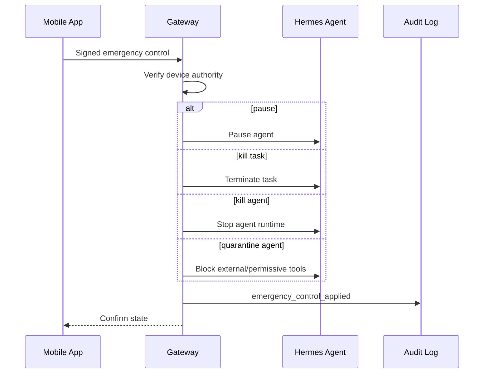

# Approval Framework

## Purpose

The approval framework turns consequential Hermes actions into explicit, scoped, auditable mobile decisions. The framework must fail closed, prevent stale or replayed approvals, and make emergency controls available when the operator needs to stop active work.

## Risk Levels

| Risk Level | Meaning | Examples | Default Handling |
| --- | --- | --- | --- |
| low | Read-only or reversible action with limited scope | Read local status, list sessions, inspect known artifact | May proceed without mobile approval if policy allows |
| medium | Action changes local state or exposes limited data | Write file in working tree, start browser navigation, run benign command | Approval may be required depending on policy and agent trust |
| high | External, destructive, sensitive, or hard-to-reverse action | Delete file, submit browser form, send email, push repository, access credentials | Mobile approval required |
| critical | Broad destructive, financial, security-sensitive, or potentially harmful action | Payment, credential exfiltration risk, network scan, privileged shell, bulk delete | Mobile approval required, critical notification, short expiry, stronger confirmation |

## Escalation Categories

The gateway approval policy must escalate at least:

- Shell execution with destructive, privileged, network, or credential-sensitive behavior
- Browser form submission, purchase, login, or external write action
- File deletion or overwrite outside explicitly allowed scratch areas
- Email send, message send, or external communication on the user's behalf
- Repository push, release, deployment, or destructive VCS action
- Payment, billing, or purchasing action
- Credential access, token access, keychain access, or secret file read
- Network scan, port scan, or probing outside an allowlisted target
- MCP tool call flagged by Hermes or tool metadata as consequential

## Approval Scopes

| Scope | Meaning | Maximum Lifetime | Notes |
| --- | --- | --- | --- |
| once | Applies only to one `action_id` | Until action executes or expires | Safest default for high and critical risk |
| session | Applies to matching action class within one session | User-configured or session end | Never crosses node or session |
| agent | Applies to matching action class for one agent | User-configured; must be revocable | Must be visible in agent detail |
| permanent | Persistent policy exception | Until revoked | Not allowed for critical actions by default |

Approval scope must include:

- `node_id`
- `agent_id`
- `session_id` where applicable
- `tool_name`
- `risk_level`
- `risk_category`
- `resource_scope`
- `expires_at`
- `requested_effect`

## Approval States

State definitions:

- `pending`: Waiting for a valid user decision.
- `approved`: Approved under an explicit scope.
- `denied`: Denied by user or policy.
- `expired`: No longer actionable because `expires_at` elapsed.
- `cancelled`: Underlying task, requester, or agent no longer needs the approval.

## Advanced Approval Responses

The compact approval states remain the durable terminal state model. Advanced mobile UX is represented through an `ApprovalResponse` record so the gateway can distinguish final state from the exact user intent.

Supported response decision types:

- `approve_once`
- `approve_session`
- `approve_agent`
- `deny`
- `modified`
- `needs_info`
- `propose_policy`

`modified`, `needs_info`, and `propose_policy` do not automatically resolve the approval. They keep the approval pending unless Hermes, gateway policy, or the user later produces a terminal decision.

`propose_policy` is the Approve Forever path. It requires a second confirmation, creates an `ApprovalPolicyProposal`, and must not activate a permanent allow policy.

### ApprovalResponse Contract

Required fields:

- `approval_response_id`
- `approval_id`
- `decision_type`
- `created_by_device_id`
- `created_at`
- `decided_at`

Optional fields:

- `user_message`
- `replacement_action`
- `constraints`
- `approved_scope`
- `policy_created`
- `expires_at`
- `assistance_session_id`
- `terminal_session_id`

### Approval Constraints

Approval constraints express user safety boundaries. Examples:

- only this directory
- read-only first
- do not touch auth
- ask again before writing
- only run tests
- only approve listed tools

If Hermes or gateway policy cannot enforce the constraints, the action remains blocked.

## Approval Request Contract

Required fields:

- `approval_id`
- `action_id`
- `node_id`
- `agent_id`
- `session_id`
- `requested_tool`
- `risk_level`
- `risk_category`
- `summary`
- `full_payload_redacted`
- `resource_scope`
- `requested_at`
- `expires_at`
- `options`
- `request_signature`

The `request_signature` is produced by the gateway, or by Hermes and countersigned by the gateway if Hermes can sign. The mobile app must show a verified status before allowing approval.

## Approval Decision Contract

Required fields:

- `approval_id`
- `decision_id`
- `decision`: `approve` or `deny`
- `scope`: `once`, `session`, `agent`, or `permanent`
- `control`: optional `pause`, `kill_task`, `kill_agent`, or `quarantine_agent`
- `device_id`
- `user_id` when user identities exist
- `signed_at`
- `expires_at`
- `decision_signature`

The `decision_signature` is generated with the mobile device private key. The gateway verifies it against the registered device public key and rejects decisions with invalid signature, stale timestamp, wrong scope, wrong node, or expired approval.

## Sequence: Approval Required

## Sequence: Expiry

## Sequence: Emergency Controls

## Emergency Controls

| Control | Effect | Reversibility | Required Audit Fields |
| --- | --- | --- | --- |
| pause | Suspends agent execution until resumed | Reversible | actor, agent, session, reason, previous state |
| kill task | Terminates current task/session activity | Not fully reversible | actor, task/session, termination reason |
| kill agent | Stops one agent runtime | Reversible by restart | actor, agent, host, resulting state |
| quarantine agent | Prevents consequential tools and external actions pending review | Reversible by explicit release | actor, policy applied, release conditions |

## Idempotency And Replay Protection

- Every approval request has globally unique `approval_id` and action-scoped `action_id`.
- Every decision has globally unique `decision_id`.
- Gateway rejects duplicate decision IDs after first accepted processing.
- Gateway rejects decisions whose signed payload does not exactly match the approval and scope.
- Gateway rejects decisions after `expires_at`.
- Gateway stores request and decision hashes in audit events.

## Policy Defaults

- High and critical actions require mobile approval.
- Critical approvals default to `once` scope.
- Permanent approvals are disabled for critical actions unless explicitly enabled by local policy.
- Stale or malformed approvals fail closed.
- Approval payloads are redacted before mobile display.
- Secrets are never allowed in push title or body.

## Implementation Interfaces

Teams should treat the approval engine as a service boundary with these responsibilities:

- Policy evaluation before consequential tool execution.
- Pending approval persistence.
- Notification trigger for pending approvals.
- Signed decision verification.
- Scoped policy grant creation.
- Emergency control dispatch.
- Audit logging.
