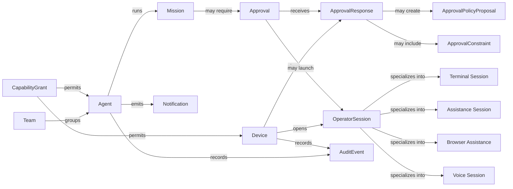

# Domain Model Review

Sprint: `HERMES-MCP-PLATFORM-CONSOLIDATION-006`

## Purpose

Hermes Mobile Control Plane has grown from a mobile safety layer into an early agent operations platform. This review identifies which records are first-class platform concepts, which are supporting value objects, and which should remain implementation details until the product needs them.

## Summary Recommendation

First-class platform concepts:

- Agent
- Mission
- Approval
- ApprovalResponse
- ApprovalPolicyProposal
- Notification
- Device
- CapabilityGrant
- OperatorSession
- AuditEvent

Supporting or embedded concepts:

- Team
- ApprovalConstraint
- TUISession
- TUASession
- BrowserAssistanceSession
- VoiceSession

Runtime Integration 007 introduced the first shared `OperatorSession` projection and a `CapabilityGrant` storage/enforcement foundation. Terminal, assistance, browser, and voice details still remain separate by design.

## Entity Review

| Entity | Purpose | Lifecycle | Owner | Relationships | Recommendation |
| --- | --- | --- | --- | --- | --- |
| Agent | Represents an operational Hermes actor that can run work, request approvals, and require intervention. | Registered by gateway, updates health/activity, may be paused, offline, or quarantined. | Hermes Gateway, sourced from Hermes runtime. | Belongs to node, may join Teams, runs Missions/Sessions, creates Approvals, Notifications, OperatorSessions, and AuditEvents. | Keep as first-class. Agent is the primary operator-facing unit. |
| Team | Organizes agents for mobile scanning by environment or responsibility. | Created/updated by user or seeded by gateway metadata. | Mobile/operator preference today; future gateway setting. | Groups Agents without replacing node identity. | Keep as UX grouping, not a control-plane authority. Treat as supporting metadata. |
| Mission | Represents a unit of work or task context across agent activity, approvals, assistance, and artifacts. | Created when Hermes starts meaningful work, updates during execution, ends as completed, cancelled, failed, or archived. | Hermes runtime with gateway projection. | Owned by Agent/Session, links to Approvals, Notifications, OperatorSessions, AuditEvents. | Keep as first-class, but standardize backend representation. Current UI mission model is ahead of durable gateway schema. |
| Approval | Blocks consequential actions until a valid signed decision or terminal state exists. | Created pending, then approved, denied, expired, or cancelled. | Gateway approval engine. | Created by Agent/Mission, decided by Device, may open TUA/TUI/Browser Assistance. | Keep as first-class. This remains the core safety primitive. |
| ApprovalResponse | Captures the operator's actual response intent, including modified decisions, requests for more info, constraints, or policy proposals. | Created by signed mobile request, may or may not resolve the Approval. | Gateway approval engine. | Belongs to Approval and Device; may include constraints or policy proposal. | Keep as first-class. It prevents overloading terminal approval state. |
| ApprovalConstraint | Expresses operator restrictions such as path, command, tool, or "ask again before writing". | Created inside an ApprovalResponse, evaluated by Hermes/gateway policy, may become policy input later. | Operator through mobile. | Belongs to ApprovalResponse; may be copied into policy proposals. | Merge into ApprovalResponse as value object for now. Do not expose as standalone resource until enforcement exists. |
| ApprovalPolicyProposal | Records an operator's request to create durable policy, especially the Approve Forever path. | Created after explicit confirmation, remains proposed/rejected/accepted by future policy workflow. | Gateway policy layer, initiated by Device. | Belongs to ApprovalResponse/Approval and may reference Agent, tool, risk category, resource scope. | Keep as first-class proposal. Do not auto-promote into active permanent policy. |
| Notification | Durable mobile-readable attention item and push dispatch source. | Created by Hermes/gateway, marked read/archived, linked to event/audit trail. | Gateway notification framework. | References Agent, Session/Mission, Approval, Voice callback, or system health. | Keep as first-class attention record. Push is a delivery hint; Notification is durable state. |
| Device | A trusted mobile app installation with a registered public key and permissions. | Paired, active, revoked/lost/disabled, eventually rotated. | Gateway identity layer. | Owns signed requests, ApprovalResponses, TUI attach tokens, AuditEvents. | Keep as first-class security principal. |
| CapabilityGrant | Authorizes a device, agent, node, or runtime caller to use operator capabilities such as TUI, TUA, browser assistance, voice, notifications, or approvals. | Granted explicitly, checked at request time, revocable, audited. | Gateway policy layer. | Applies to Device, Agent, Node, runtime caller, capability, and optional agent scope. | Keep as first-class. Runtime Integration 007 added the initial table and centralized helper; grant management UX remains future work. |
| TUISession | Represents terminal access to a node/agent context. | Requested, active, detached, closed, or failed. | Gateway TUI subsystem. | Created by Device, references Agent/Node, audited, may be launched from Approval. | Keep as specialized OperatorSession subtype. Do not keep as totally separate concept long-term. |
| TUASession | Represents take-user-assistance collaboration between operator and agent. | Requested, active/waiting/user controlling, returned, closed, or cancelled. | Gateway assistance subsystem. | References Agent/Mission/Approval, has AssistanceMessages, emits events/audit. | Keep as specialized OperatorSession subtype. |
| BrowserAssistanceSession | Represents operator assistance for a browser task without full browser streaming. | Requested, active/user controlling, returned, closed, or failed. | Gateway browser assistance subsystem. | References Agent/Mission/Approval, has notes/events, emits audit. | Keep as specialized OperatorSession subtype until browser streaming makes it richer. |
| VoiceSession | Represents text-backed voice MVP interaction and future audio session. | Created, active, receives messages, closed. | Gateway voice subsystem. | References Agent/Session, Device, VoiceMessages, events/audit. | Keep as specialized OperatorSession subtype with audio-specific fields separate. |
| AuditEvent | Immutable evidence of security and operator actions. | Appended once and retained according to policy. | Gateway audit layer. | References all sensitive entities and signed requests. | Keep as first-class platform backbone. It should outlive UI models. |

## Concept Map

## Cleanup Recommendations

High confidence:

- Make `Mission` the durable work-context model across Home, Agents, approvals, TUA, TUI, browser assistance, and voice.
- Continue using `OperatorSession` as a shared projection for TUI, TUA, browser assistance, and voice.
- Continue promoting `CapabilityGrant` into visible, revocable operator policy before beta.
- Keep `ApprovalResponse` separate from `Approval.state`; terminal state should remain compact and fail-closed.

Medium confidence:

- Treat Teams as local/operator grouping until multi-user or fleet policy needs shared team ownership.
- Collapse `ApprovalConstraint` into `ApprovalResponse.constraints` unless policy enforcement becomes a standalone product area.
- Rename UI "missions" only if Hermes runtime uses a stronger canonical term. Until then, Mission is the clearest operator word.

Avoid:

- Do not merge Notifications with Events. Notifications are attention items; events are timeline facts.
- Do not treat TUI/TUA/browser/voice as equivalent at the permission layer. They can share an OperatorSession base while keeping separate security checks.
- Do not create active permanent allow policies from Approve Forever until policy review, revocation, and display UX are complete.
