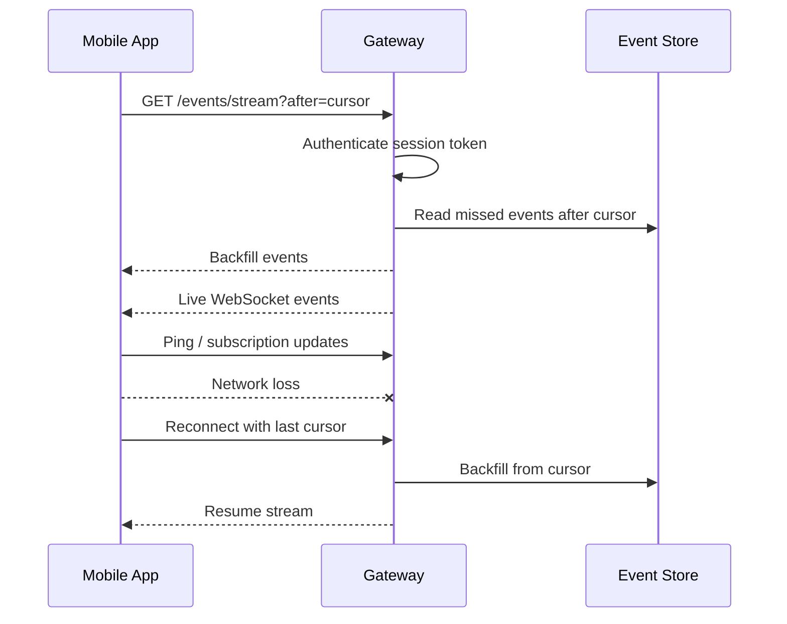

# Event Streaming Architecture

## Purpose

Live activity monitoring requires a transport that works well on mobile, supports low-latency bidirectional control, reconnects cleanly, and does not require public exposure.

## Transport Candidates

| Transport | Latency | Complexity | Mobile Support | Offline/Reconnect | Fit |
| --- | --- | --- | --- | --- | --- |
| WebSocket | Low | Moderate | Strong on iOS/Android | Requires cursored backfill | Best primary choice |
| SSE | Low to moderate | Low | Usable, but less ideal for mobile backgrounding | Simple server-to-client only | Good secondary read-only stream |
| MQTT | Low | Higher operational overhead | Strong with libraries | Good session semantics | Overkill for first self-hosted gateway |
| WebRTC data channels | Very low | High | Strong but NAT/signaling complexity | Requires signaling and session management | Use for voice/browser later, not core events |

## Recommendation

Use WebSocket as the primary live event transport over Tailscale/local network, paired with REST backfill by cursor.

Rationale:

- Bidirectional enough for pings, subscriptions, and lightweight control acknowledgements.
- Good mobile support without requiring an MQTT broker.
- Fits direct self-hosted gateway deployment.
- Easier than WebRTC for authenticated event streams.
- Can coexist with future WebRTC for voice or live browser streams.

## Event Envelope

All streamed events use a common envelope:

```json
{
  "event_id": "evt_01J...",
  "cursor": "node-001:00000000042",
  "node_id": "node_01J...",
  "agent_id": "agent_01J...",
  "session_id": "sess_01J...",
  "conversation_id": "conv_01J...",
  "type": "agent.status.updated",
  "severity": "info",
  "occurred_at": "2026-06-03T17:00:00Z",
  "payload": {},
  "redaction": {
    "payload_redacted": false,
    "reason": null
  }
}
```

## Event Types

Core event families:

- `node.health.updated`
- `agent.registered`
- `agent.health.updated`
- `session.started`
- `session.updated`
- `session.completed`
- `conversation.message.created`
- `conversation.message.delta`
- `tool.run.started`
- `tool.run.updated`
- `tool.run.completed`
- `browser.state.updated`
- `approval.requested`
- `approval.updated`
- `notification.updated`
- `intervention.applied`
- `voice.session.updated`
- `audit.event.created`

## Stream Lifecycle



## Subscription Model

Default subscription:

- Node health
- Active agents
- Active sessions
- Pending approvals
- Notifications
- User-visible audit events

Optional filters:

- `node_id`
- `agent_id`
- `session_id`
- `event_types`
- `since`
- `severity`

## Backfill And Offline Behavior

- Gateway persists recent event envelopes for backfill.
- Mobile app stores last processed cursor per node.
- On reconnect, mobile requests backfill after the last cursor.
- If cursor is too old, gateway returns `cursor_expired`; mobile fetches current state snapshots and resumes from latest cursor.
- Push notifications wake the user but do not replace event backfill.

Recommended retention:

- Live event backfill: 7 days or 100,000 events per node, whichever comes first.
- Audit log: longer retention; see [Data Model](../data-model.md).

## Backpressure

Gateway may coalesce high-frequency events:

- Terminal output chunks
- Browser screenshot updates
- Token deltas
- Health heartbeats

Coalescing rules:

- Never coalesce approval state transitions.
- Never drop audit events.
- Never reorder events within the same session.
- Preserve final state events after coalescing.

## Mobile Backgrounding

- Foreground app maintains WebSocket where network allows.
- Background app relies on platform push and periodic foreground reconciliation.
- On foreground, app performs state refresh and event backfill.
- Voice sessions may use platform-specific background audio permissions in voice phases only.

## Security

- WebSocket handshake requires a valid session token.
- Token is bound to registered device identity.
- Gateway must authorize requested subscriptions.
- Event payloads must be redacted according to policy before streaming.
- Sensitive payloads use detail fetch endpoints with stricter authorization rather than broad stream delivery.
