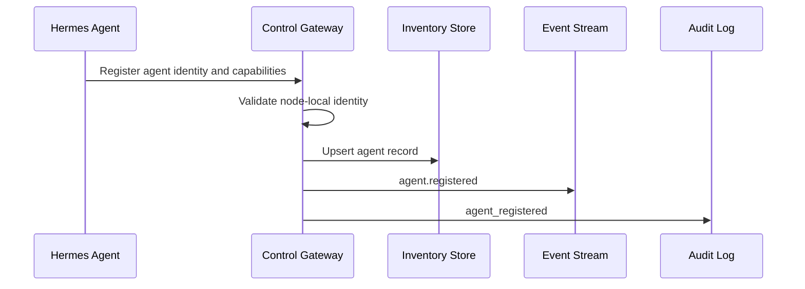

# Multi-Agent Control Plane

## Purpose

The multi-agent control plane lets mobile users operate one or more Hermes nodes across homelab, laptop, cloud, workstation, and future enterprise environments without confusing identities, sessions, approvals, or audit trails.

## Core Concepts

- **Node**: One Hermes install with one Control Gateway.
- **Agent**: A Hermes agent registered under a node.
- **Environment**: User-facing grouping such as homelab, laptop, cloud, or workstation.
- **Capability**: A declared function an agent or node supports.
- **Tag**: User or gateway assigned metadata for filtering.
- **Inventory**: The mobile-visible registry of nodes, agents, health, capabilities, and labels.

## Agent Registration

Registration happens between a backend runtime adapter and the ACT Gateway.
Hermes remains the first concrete adapter.



Required registration fields:

- `node_id`
- `agent_id`
- `display_name`
- `agent_kind`
- `environment`
- `capabilities`
- `version`
- `started_at`
- `health`

## Agent Discovery

Discovery modes:

| Mode | Scope | Use |
| --- | --- | --- |
| Local gateway inventory | One node | Default source of truth for agents on a node |
| Mobile saved inventory | Many nodes | User's registered node list and last-known state |
| Optional relay directory | Many nodes | Future convenience for non-tailnet users |

The mobile app must not auto-trust discovered agents. Trust begins with node pairing and gateway device registration.

## Health Reporting

Agents report:

- `status`: `idle`, `running`, `blocked`, `paused`, `stopping`, `offline`, `error`, `quarantined`
- `last_seen_at`
- `active_session_id`
- `active_task_summary`
- `current_tool`
- `current_target`
- `blocked_reason`
- `resource_summary`
- `capability_status`

Gateway computes node-level health:

- Gateway status
- Hermes runtime status
- Agent count by state
- Pending approval count
- Event stream status
- Push dispatcher status
- Voice subsystem status

## Grouping And Tags

Supported environment values:

- `homelab`
- `laptop`
- `cloud`
- `workstation`
- `vps`
- `work_vm`
- `custom`

Tags are arbitrary strings normalized to lowercase slug form. Examples:

- `personal`
- `work`
- `prod`
- `dev`
- `browser-enabled`
- `voice-enabled`
- `high-trust`
- `approval-strict`

## Capabilities

Capability examples:

- `chat`
- `sessions`
- `artifacts`
- `tool_history`
- `approvals`
- `interventions`
- `browser_view`
- `browser_takeover`
- `terminal_stream`
- `voice_push_to_talk`
- `voice_full_duplex`
- `memory_view`
- `skills_view`
- `task_transfer`

Capabilities include status:

- `available`
- `disabled`
- `requires_pairing`
- `requires_permission`
- `unsupported`
- `degraded`

## Inventory Schema

```json
{
  "nodes": [
    {
      "node_id": "node_01J...",
      "display_name": "Homelab Hermes",
      "environment": "homelab",
      "gateway_base_url": "https://100.x.y.z:8787",
      "connectivity": {
        "mode": "tailscale",
        "last_success_at": "2026-06-03T17:00:00Z",
        "status": "online"
      },
      "tags": ["personal", "approval-strict"],
      "capabilities": [
        {"name": "chat", "status": "available"},
        {"name": "approvals", "status": "available"},
        {"name": "voice_full_duplex", "status": "unsupported"}
      ],
      "agents": [
        {
          "agent_id": "agent_01J...",
          "display_name": "Hermes Main",
          "agent_kind": "primary",
          "status": "running",
          "active_session_id": "sess_01J...",
          "current_tool": "browser",
          "current_target": "github.com",
          "tags": ["browser-enabled"],
          "capabilities": [
            {"name": "browser_view", "status": "available"}
          ],
          "last_seen_at": "2026-06-03T17:00:00Z"
        }
      ]
    }
  ]
}
```

## Task Movement And Redirection

Task or conversation transfer is allowed only when:

- Source and destination nodes are both trusted by the same device/user.
- Source and destination agents declare `task_transfer`.
- The transfer does not move secrets or non-transferable local artifacts without explicit approval.
- The source gateway records a transfer-out audit event.
- The destination gateway records a transfer-in audit event.
- The user sees source and destination context before confirmation.

Critical or high-risk active tasks should require approval before transfer.

## Global Dashboard

Dashboard aggregates:

- Node health
- Active agent count
- Pending approvals
- Critical alerts
- Blocked tasks
- Recently completed tasks
- Voice callbacks
- Quarantined agents

The dashboard must preserve node identity on every row, card, notification, and action.

## Failure Modes

- Node unreachable: show last-known inventory and disable live actions.
- Agent missing from latest inventory: mark stale, do not delete immediately.
- Duplicate agent IDs across nodes: namespace by `node_id`.
- Gateway version mismatch: show unsupported capabilities and disable affected actions.
- Transfer fails: retain original task context and audit failure.
