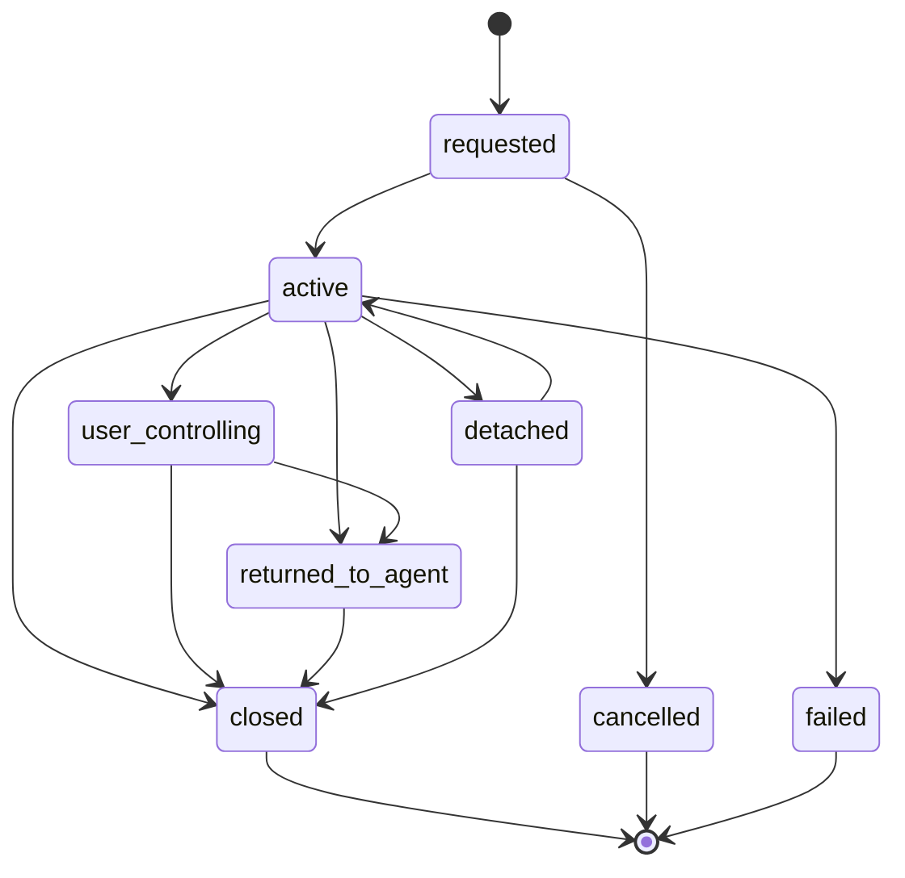

# Operator Session Review

Sprint: `HERMES-MCP-PLATFORM-CONSOLIDATION-006`

## Question

Are TUI, TUA, Browser Assistance, and Voice specialized forms of a common platform abstraction?

## Recommendation

Yes, but introduce the abstraction gradually.

The product already treats these features as ways for a human operator to enter an agent's work context, provide input, then return control or close the intervention. That shared product shape is strong enough to justify `OperatorSession` as a platform concept. The implementation should not immediately collapse all route handlers or storage tables into one generic system, because each mode has different safety rules and transport requirements.

## Shared Product Shape

All operator sessions have the same high-level lifecycle:

Not every subtype uses every state. TUI uses `detached`; TUA and browser assistance use `returned_to_agent`; voice mostly uses `active` and `closed`.

## Shared Fields

Recommended base fields:

| Field | Purpose |
| --- | --- |
| `operator_session_id` | Stable shared ID for cross-mode references. |
| `kind` | `terminal`, `assistance`, `browser`, or `voice`. |
| `node_id` | Gateway/node scope. |
| `agent_id` | Agent being assisted or controlled. |
| `mission_id` | Work context once Mission is durable. |
| `approval_id` | Optional approval that launched the session. |
| `created_by_device_id` | Signing mobile device. |
| `state` | Shared coarse state. |
| `risk_level` | Operator-visible safety level. |
| `reason` | Redacted reason for opening the session. |
| `context_redacted` | Mode-independent safe context. |
| `created_at` | Creation time. |
| `last_activity_at` | Last message, terminal I/O, note, or state change. |
| `returned_at` | Time control was returned to Hermes, where applicable. |
| `closed_at` | Close time. |
| `audit_refs` | Audit event IDs. |

## Subtype Fields That Should Stay Separate

Terminal sessions:

- PTY runtime ID
- command and working directory
- attach token records
- resize state
- output retention flag
- paste metadata
- terminal protocol frame handling

Assistance sessions:

- assistance request ID
- assistance messages
- return-control summary
- user/agent speaker metadata

Browser assistance:

- browser context
- current URL or page title when available
- operator notes
- future screenshot/WebRTC stream metadata
- return-control summary

Voice sessions:

- voice mode
- text fallback or simulated voice metadata
- future audio transport/provider metadata
- voice messages

## Why Not Force A Refactor Now

The current implementation intentionally keeps dangerous surfaces separated:

- TUI has shell-execution risks and attach-token handling.
- Browser assistance can eventually control external websites.
- Voice will eventually carry audio capture and playback risks.
- TUA is collaboration-oriented and should not inherit terminal permissions.

A premature generic route layer could make authorization blurry. The better next step is a shared schema and shared audit/event helper, then route-specific implementations can converge over time.

## Recommended Migration Path

1. Add an `operator_sessions` projection table or view that can reference existing subtype records.
2. Centralize shared event names and audit metadata for session lifecycle actions.
3. Add a mobile `OperatorSessionSummary` model for Home, Inbox, Missions, and Agent Detail.
4. Keep subtype repositories for terminal, assistance, browser, and voice behavior.
5. Later, evaluate whether storage can be normalized without losing subtype-specific safety checks.

## Decision

Create `OperatorSession` as a first-class product and architecture concept, but do not force immediate code consolidation. The initial cleanup should target naming, shared event/audit helpers, and mobile summaries.
