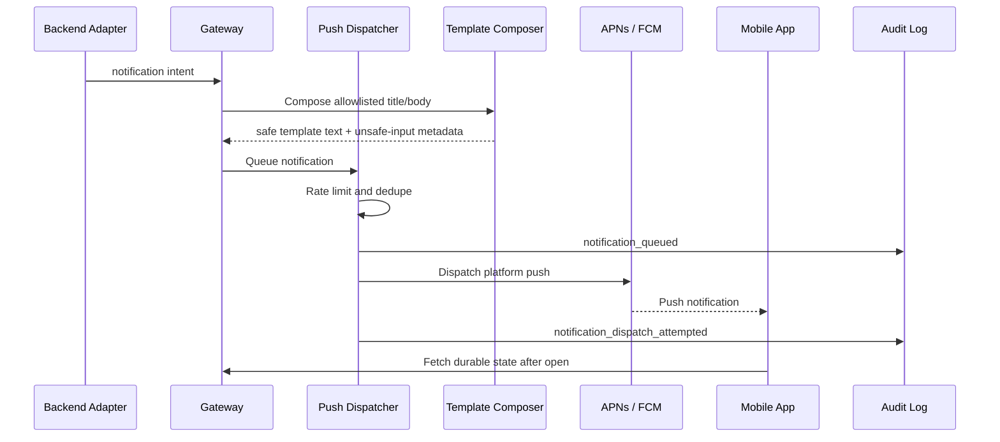

# Push Notification Framework

## Purpose

Push notifications wake the mobile operator for urgent ACT backend events. They are not durable state, do not contain secrets, and do not replace the clearance queue, audit log, or event stream.

## `mobile_notify` Tool Contract

Backends can request notification intent through the gateway. Legacy
Hermes-compatible fields remain accepted, but ACT composes visible notification
text from allowlisted templates.

Required fields:

| Field | Type | Description |
| --- | --- | --- |
| `title` | string | Legacy raw title input; never echoed directly to push text |
| `body` | string | Legacy raw body input; never echoed directly to push text |
| `urgency` | enum | `low`, `normal`, `high`, `critical` |
| `category` | enum | See notification categories |
| `agent_id` | string | Requesting agent |
| `session_id` | string | Related session |

Optional fields:

| Field | Type | Description |
| --- | --- | --- |
| `action_id` | string | Approval or tool action ID when applicable |
| `deep_link` | string | Mobile route to related state |
| `dedupe_key` | string | Stable key for collapsing repeated events |
| `expires_at` | datetime | Time after which notification is no longer actionable |
| `subject_display_name` | string | Safe backend/agent display label |
| `risk_family` | string | Safe risk label for templates |
| `operation_label` | string | Safe generic operation label |
| `pending_count` | integer | Safe count of pending items |

## Notification Categories

| Category | Meaning | Default Urgency |
| --- | --- | --- |
| `approval_required` | User decision needed before consequential action | high |
| `security_alert` | Security-sensitive or policy-denied activity | critical |
| `agent_blocked` | Agent cannot proceed without help | high |
| `task_complete` | Long-running task completed | normal |
| `system_health` | Node, gateway, or agent health issue | normal |
| `voice_callback` | Agent requests voice conversation or voice mode reconnect | high |

## Urgency Semantics

| Urgency | Behavior |
| --- | --- |
| low | Batch with other low-priority notifications; may be delayed |
| normal | Deliver soon; may be grouped by node/session |
| high | Dispatch immediately with deep link when available |
| critical | Dispatch immediately, request OS-level critical/interruption behavior where configured and allowed |

Critical delivery depends on OS permissions, platform rules, and user settings. The gateway must audit the attempt even when the OS does not bypass quiet mode.

## Delivery Flow

## Payload Rules

- Push payloads must be minimal.
- Push title/body must not contain secrets, tokens, credentials, file contents, command output, private keys, raw prompts, stack traces, or raw tool payloads.
- ACT must not echo backend-supplied raw `title` or `body` directly into visible push text.
- Secret/entropy detection is a backstop only; allowlist template composition is the primary control.
- Deep links must reference IDs, not embed sensitive data.
- Approval details are fetched from the gateway after authentication.
- Notifications include `node_id`, `category`, and opaque IDs only where platform limits allow.
- Audit records include `composition_mode`, template name, safe fields, and unsafe-input reasons when detected.

## Rate Limits

Gateway default rate limits:

| Scope | Limit |
| --- | --- |
| Per device | 30 notifications per 10 minutes |
| Per node | 60 notifications per 10 minutes |
| Per agent | 20 notifications per 10 minutes |
| Per approval action | 3 reminders before expiry |
| Critical category | No silent batching, but still deduped by action/session |

Rate limit behavior:

- Low/normal notifications are batched or summarized.
- High notifications are deduped by `dedupe_key`, `action_id`, or `(category, agent_id, session_id)`.
- Critical notifications bypass normal batching but repeated identical critical events are collapsed.
- Rate-limit drops and summaries are audit logged.

## Deduplication

Preferred dedupe key order:

1. Explicit `dedupe_key`
2. `action_id`
3. `category + node_id + agent_id + session_id + normalized_title`

Deduplication windows:

- `approval_required`: until approval resolves or expires
- `agent_blocked`: 10 minutes
- `system_health`: 15 minutes
- `task_complete`: 5 minutes
- `security_alert`: 5 minutes unless unique action ID differs
- `voice_callback`: 3 minutes

## Delivery Guarantees

Push notifications are best effort. The system guarantees:

- Notification request is validated or rejected deterministically.
- Notification request and dispatch attempt are audit logged.
- Durable state remains available through the gateway.
- Mobile app reconciles notification state by fetching from the gateway.

The system does not guarantee:

- OS display.
- Quiet-mode bypass.
- User interaction.
- APNs/FCM delivery timing.

## Audit Logging

Audit event types:

- `notification_requested`
- `notification_rejected`
- `notification_queued`
- `notification_rate_limited`
- `notification_deduped`
- `notification_dispatch_attempted`
- `notification_opened`
- `notification_deep_link_resolved`

Required audit fields:

- `event_id`
- `node_id`
- `agent_id`
- `session_id`
- `action_id` when present
- `device_id` when targeted
- `category`
- `urgency`
- `policy_result`
- `created_at`
- `request_hash`
- `dispatch_provider` when dispatched

## Failure Handling

- Secret scan failure rejects the notification and records `notification_rejected`.
- Push provider failure records dispatch failure and keeps durable gateway state.
- Mobile app offline state is handled by fetching approval/event backfill on reconnect.
- Notification open after session end shows resolved historical state, not stale action controls.
