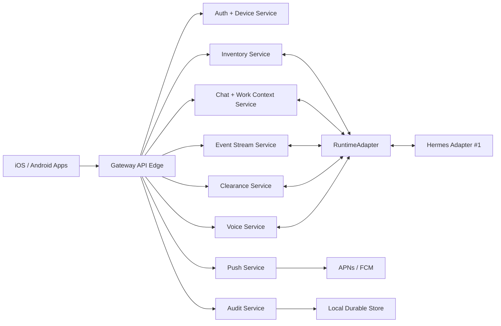

# Service Boundaries

## Purpose

This document defines implementation team boundaries. In the self-hosted MVP,
these services can run inside one ACT Gateway process. The boundaries still
matter because they keep the control tower, runtime adapters, mobile clients,
and backend-specific integrations honest.

## Service Map

## Boundaries

| Service | Owns | Inputs | Outputs |
| --- | --- | --- | --- |
| API Edge | Request routing, auth middleware, request IDs, error shape | Mobile/gateway HTTP and WebSocket requests | Validated service calls |
| Auth + Device Service | Pairing, device registry, session tokens, revocation, key rotation | Pairing requests, token refresh, signed device operations | Device records, tokens, auth audit events |
| Inventory Service | Node and agent registry, capabilities, health snapshots, tags | Hermes registration/health events, mobile labels | Inventory API responses, health events |
| Chat + Work Context Service | Mobile chat relay, conversations, work snapshots, artifacts metadata | Mobile messages, backend responses | Message events, work updates |
| Event Stream Service | Event envelope, cursoring, backfill, subscriptions, coalescing | Service events, backend events | WebSocket events, REST backfill |
| Clearance Service | Risk policy, clearance queue, decision verification, emergency controls | RuntimeAdapter clearance requests, signed mobile decisions | Policy grants, interventions, clearance audit |
| Push Service | `mobile_notify`, secret filtering, dedupe, rate limits, APNs/FCM dispatch | Notification requests, approval triggers | Push attempts, notification records |
| Voice Service | Voice sessions, provider adapters, push-to-talk, WebRTC future coordination | Audio/transcript turns, Hermes voice events | Voice events, transcripts, audio references |
| Audit Service | Append-only audit log, hash chaining, export | Events from all services | Audit records and query/export responses |
| RuntimeAdapter | Backend-neutral seam for work state, notices, clearances, and handoffs | Service commands, backend-specific adapters | Backend events and command results |
| Hermes Adapter | Runtime-specific bridge to Hermes, MCP, browser, shell, voice | RuntimeAdapter calls | Hermes events and command results |

## Team Ownership

| Team | Primary Documents |
| --- | --- |
| Gateway/runtime adapter | [System Architecture](system-architecture.md), [Service Boundaries](service-boundaries.md), [API Contract](../api/openapi.yaml) |
| Mobile backend services | This document, [Data Model](../data-model.md), [Auth](../security/auth-authorization.md), [Event Streaming](event-streaming.md) |
| Clearance/intervention | [Approval Framework](approval-framework.md), [Threat Model](../security/threat-model.md), ADR-0006 |
| Push | [Push Notification Framework](push-notification-framework.md), ADR-0005 |
| Multi-agent | [Multi-Agent Control Plane](multi-agent-control-plane.md), [Data Model](../data-model.md) |
| Voice | [Voice Architecture](voice-architecture.md), ADR-0008 |
| iOS/Android | [Mobile UX Architecture](../mobile-ux-architecture.md), [API Contract](../api/openapi.yaml), [Auth](../security/auth-authorization.md) |

## Integration Rules

- Services communicate through typed internal messages or direct module calls in MVP.
- Every external request receives a request ID from API Edge.
- Every consequential service action emits an audit event.
- Clearance Service is the only service that may create scoped clearance grants.
- Push Service cannot create clearances; it can only notify about durable state.
- Event Stream Service emits redacted event payloads only.
- Runtime adapters never bypass Clearance Service for consequential actions.
- Voice Service cannot grant actions except by creating normal signed clearance decisions through Clearance Service.

## Future Hosted Relay Compatibility

If a future relay is introduced:

- API Edge may be reachable through relay.
- Auth + Device Service remains gateway authoritative for self-hosted nodes.
- Clearance Service remains gateway authoritative.
- Push Service may optionally use relay for device fanout, but durable state remains gateway-side.
- Audit Service remains local by default, with optional export/replication later.
