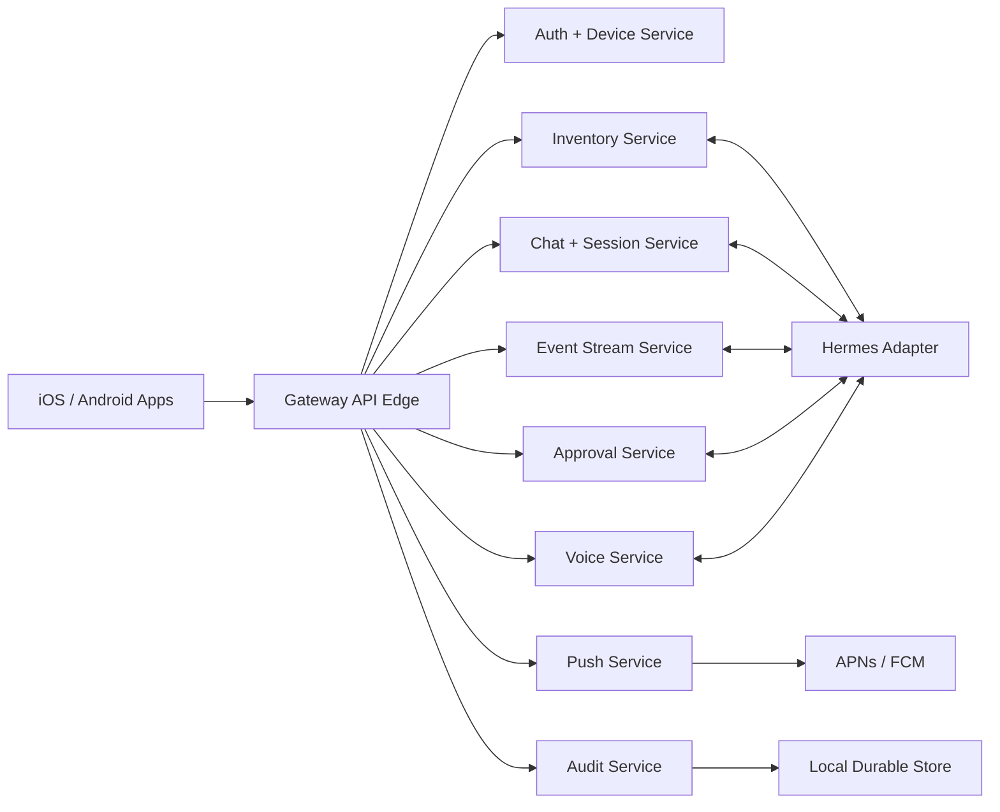

# Service Boundaries

## Purpose

This document defines implementation team boundaries. In the self-hosted MVP, these services can run inside one Hermes Control Gateway process. The boundaries still matter because they let separate teams implement modules independently and make future relay or enterprise support possible.

## Service Map

## Boundaries

| Service | Owns | Inputs | Outputs |
| --- | --- | --- | --- |
| API Edge | Request routing, auth middleware, request IDs, error shape | Mobile/gateway HTTP and WebSocket requests | Validated service calls |
| Auth + Device Service | Pairing, device registry, session tokens, revocation, key rotation | Pairing requests, token refresh, signed device operations | Device records, tokens, auth audit events |
| Inventory Service | Node and agent registry, capabilities, health snapshots, tags | Hermes registration/health events, mobile labels | Inventory API responses, health events |
| Chat + Session Service | Mobile chat relay, conversations, session snapshots, artifacts metadata | Mobile messages, Hermes responses | Message events, session updates |
| Event Stream Service | Event envelope, cursoring, backfill, subscriptions, coalescing | Service events, Hermes events | WebSocket events, REST backfill |
| Approval Service | Risk policy, approval queue, decision verification, emergency controls | Hermes tool requests, signed mobile decisions | Policy grants, interventions, approval audit |
| Push Service | `mobile_notify`, secret filtering, dedupe, rate limits, APNs/FCM dispatch | Notification requests, approval triggers | Push attempts, notification records |
| Voice Service | Voice sessions, provider adapters, push-to-talk, WebRTC future coordination | Audio/transcript turns, Hermes voice events | Voice events, transcripts, audio references |
| Audit Service | Append-only audit log, hash chaining, export | Events from all services | Audit records and query/export responses |
| Hermes Adapter | Runtime-specific bridge to Hermes, MCP, browser, shell, voice | Service commands | Hermes events and command results |

## Team Ownership

| Team | Primary Documents |
| --- | --- |
| Hermes-side gateway | [System Architecture](system-architecture.md), [Service Boundaries](service-boundaries.md), [API Contract](../api/openapi.yaml) |
| Mobile backend services | This document, [Data Model](../data-model.md), [Auth](../security/auth-authorization.md), [Event Streaming](event-streaming.md) |
| Approval/intervention | [Approval Framework](approval-framework.md), [Threat Model](../security/threat-model.md), ADR-0006 |
| Push | [Push Notification Framework](push-notification-framework.md), ADR-0005 |
| Multi-agent | [Multi-Agent Control Plane](multi-agent-control-plane.md), [Data Model](../data-model.md) |
| Voice | [Voice Architecture](voice-architecture.md), ADR-0008 |
| iOS/Android | [Mobile UX Architecture](../mobile-ux-architecture.md), [API Contract](../api/openapi.yaml), [Auth](../security/auth-authorization.md) |

## Integration Rules

- Services communicate through typed internal messages or direct module calls in MVP.
- Every external request receives a request ID from API Edge.
- Every consequential service action emits an audit event.
- Approval Service is the only service that may create scoped approval grants.
- Push Service cannot create approvals; it can only notify about durable state.
- Event Stream Service emits redacted event payloads only.
- Hermes Adapter never bypasses Approval Service for consequential actions.
- Voice Service cannot approve actions except by creating normal signed approval decisions through Approval Service.

## Future Hosted Relay Compatibility

If a future relay is introduced:

- API Edge may be reachable through relay.
- Auth + Device Service remains gateway authoritative for self-hosted nodes.
- Approval Service remains gateway authoritative.
- Push Service may optionally use relay for device fanout, but durable state remains gateway-side.
- Audit Service remains local by default, with optional export/replication later.
