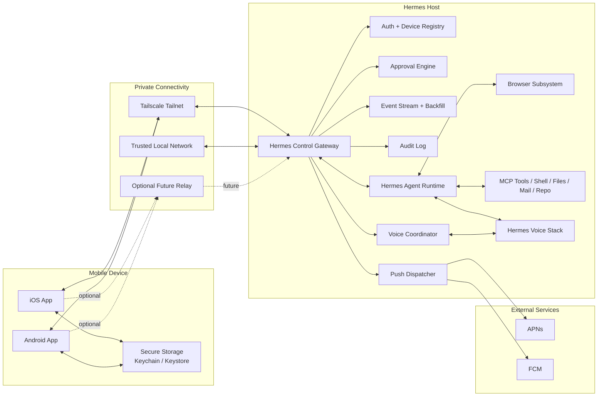
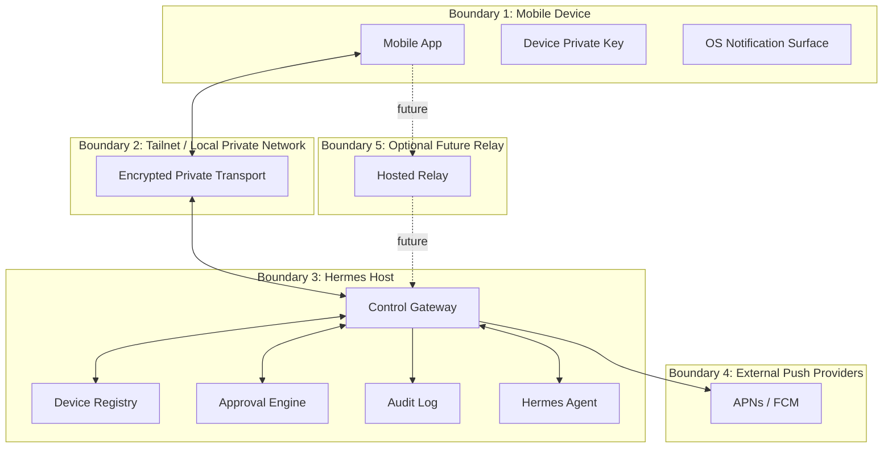
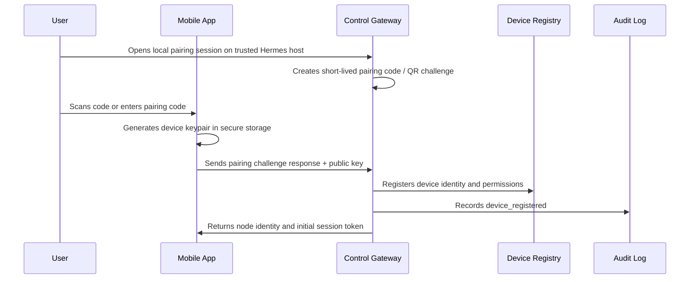
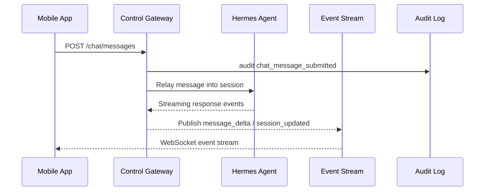
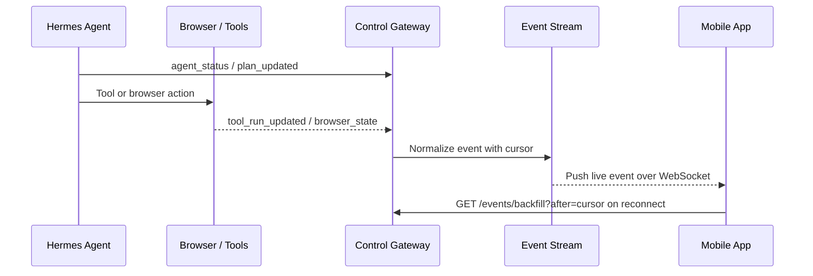
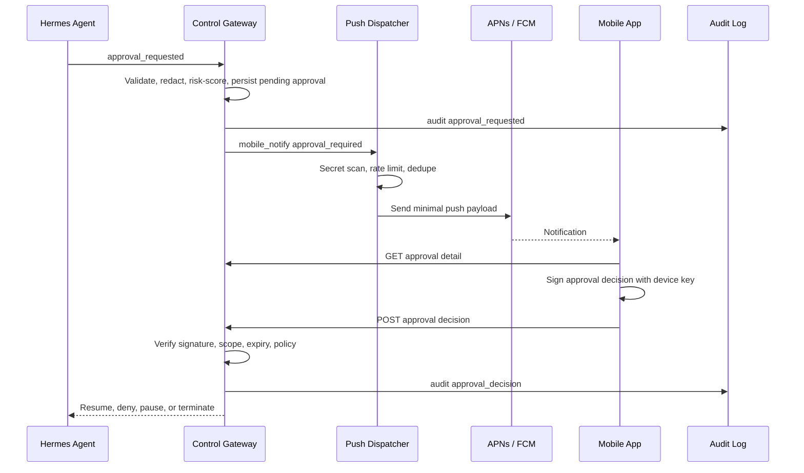
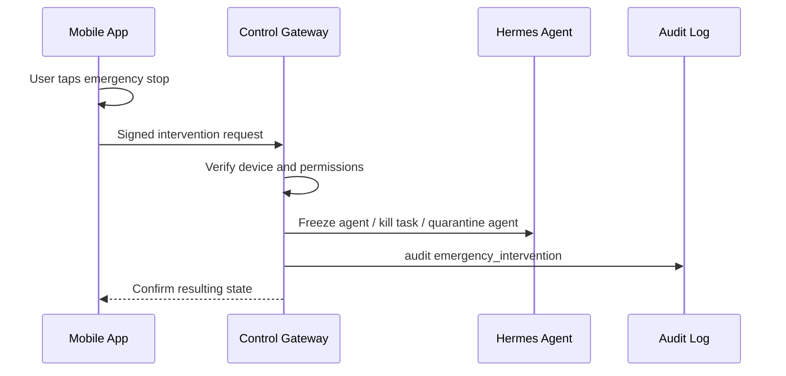

# System Architecture

## Purpose

Hermes Mobile Control Plane gives mobile users a private, auditable command surface for Hermes installs. It is self-hosted first, Tailscale first, and designed so a single Hermes node works on day one while many nodes, future relay access, and enterprise support remain possible.

This is an architecture foundation, not production implementation.

## Principles

- Self-hosted Hermes nodes do not require public exposure.
- Tailscale is the default connectivity path.
- The Hermes Control Gateway is the mobile-facing sidecar beside each Hermes install.
- Mobile approvals are safety-critical signed decisions, not ordinary chat messages.
- Push notifications are wake-up hints and never the durable source of truth.
- Audit logging is required for notification, approval, intervention, auth, and policy events.
- Hosted dependencies are avoided except where mobile platform push delivery requires APNs and FCM.

## High-Level Architecture



## Deployment Topology

### Phase 1 Topology

One mobile app connects directly to one Hermes Control Gateway over Tailscale or trusted local network. The gateway runs on the same host or private network as Hermes and exposes pairing, REST state APIs, WebSocket events, approval APIs, and audit queries.

### Multi-Node Topology

Each Hermes node runs its own gateway. The mobile app stores a local inventory of registered gateways and connects to one or more gateways as needed. There is no required central coordinator.

### Optional Future Relay Topology

A relay may broker connectivity for users who cannot manage tailnets or local network access. The relay must not become required for self-hosted operation. It should forward encrypted sessions and avoid storing durable approval payloads where possible.

## Component Responsibility Matrix

| Component | Responsibilities | Does Not Own |
| --- | --- | --- |
| iOS App | Mobile UX, secure device key storage, pairing initiation, chat UI, approvals, live activity, notifications, voice UI, local node inventory | Server-side policy, durable audit storage, Hermes execution |
| Android App | Same as iOS with Android-specific notification, secure storage, and permission handling | Server-side policy, durable audit storage, Hermes execution |
| Hermes Control Gateway | Mobile API, device registry, auth, session token minting, event stream, approval queue, policy gate, audit log, push dispatch, agent inventory, voice coordination | Core Hermes reasoning, tool execution internals, mobile UI |
| Hermes Agent Runtime | Conversations, sessions, agent planning, tool requests, memory and skill use, session artifacts | Mobile auth, mobile audit retention, push provider integration |
| MCP Tools | Tool execution under Hermes policy and gateway approval constraints | Approval UI, notification routing, device trust |
| Browser Subsystem | Browser automation, screenshots, tab/session state, takeover hooks where supported | Mobile auth, push delivery |
| Voice Subsystem | Speech input/output integration, voice session media, voice mode state | Approval signing, device registration |
| Push Dispatcher | Secret filtering, notification rate limits, APNs/FCM dispatch, delivery attempt audit | Durable approval state, business logic execution |
| Event Stream + Backfill | WebSocket stream, event cursoring, replay after reconnect, live state fan-out | Long-term analytics warehouse |
| Audit Log | Immutable local record of auth, notification, approval, intervention, policy, and gateway events | User-facing notification delivery guarantee |
| Optional Relay | Future connectivity broker for non-tailnet users | Required self-hosted connectivity, approval source of truth |

## Trust Boundary Diagram



Trust boundary implications:

- Mobile device compromise can expose local node metadata and live session access until revoked.
- Tailscale identity helps authenticate network-level reachability but does not replace device registration.
- Gateway policy is authoritative for approvals and interventions.
- Push providers are untrusted for sensitive content. Payloads must be minimal and secret-free.
- Optional relay is untrusted for approval payload confidentiality unless end-to-end encryption is added.

## Core Data Flows

### Pairing Flow



### Chat Flow



### Live Activity Flow



### Approval And Push Flow



### Emergency Intervention Flow



### Voice Session Flow

```mermaid
sequenceDiagram
  participant M as Mobile App
  participant G as Voice Coordinator
  participant V as Hermes Voice Stack
  participant H as Hermes Agent
  participant A as Audit Log

  M->>G: Create voice session
  G->>A: audit voice_session_started
  M<->>G: Audio transport
  G<->>V: STT/TTS or voice mode bridge
  V<->>H: Voice instruction / response
  G-->>M: Agent audio and state updates
```

## Observability Requirements

- Every gateway request receives a request ID.
- Every event has `event_id`, `node_id`, `agent_id` when applicable, `session_id` when applicable, and monotonic `cursor`.
- Approval, intervention, notification, auth, policy, and voice events are audit logged.
- Gateway exposes health status for mobile and local diagnostics.
- Mobile app records non-sensitive client telemetry locally and may expose it for support export.

## Architectural Open Items

- Exact Hermes internal adapter APIs for agent, browser, shell, voice, and MCP event capture.
- Whether the gateway stores audit entries in Hermes' existing storage or its own local store.
- Whether future relay traffic is end-to-end encrypted at the application layer.
- Enterprise identity model beyond device-first local trust.
