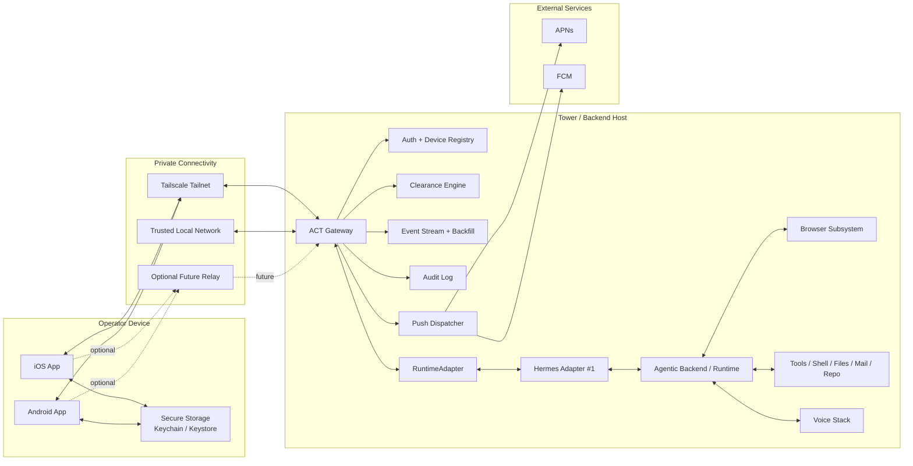
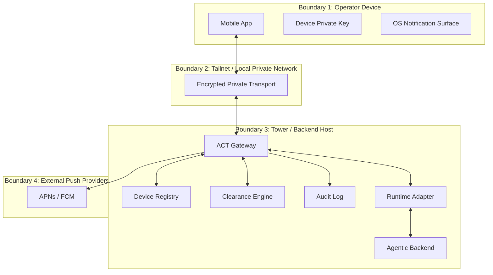
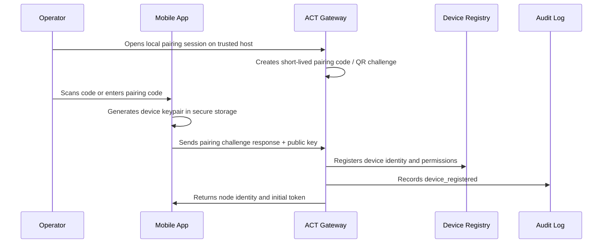
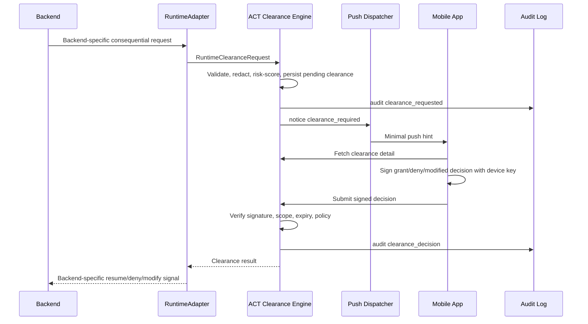
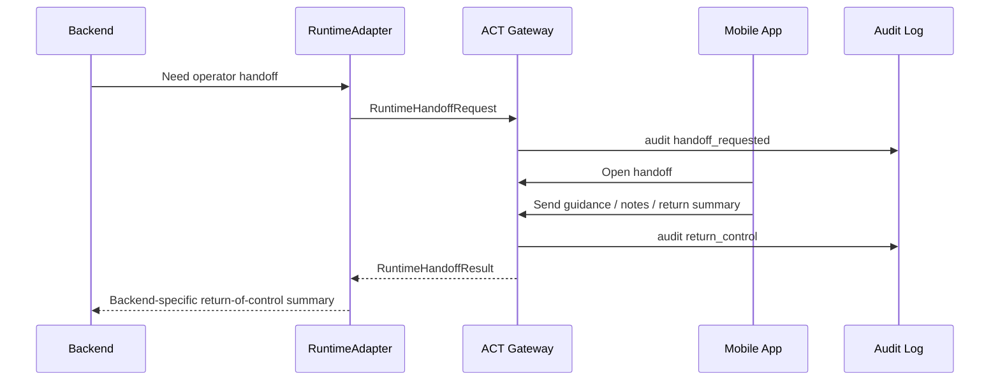

# System Architecture

## Purpose

Agentic Control Tower gives operators a private, auditable control tower for
agentic backends. It is self-hosted first and Tailscale first. Hermes is the
first concrete backend through the Hermes adapter, but the generic tower
boundary is `RuntimeAdapter`.

ACT does not execute backend actions. It grants or denies clearances, sequences
operator handoffs, tracks state, keeps the log, and enforces procedure. The
backends and agents are the aircraft; they do the flying.

## Principles

- Self-hosted backends do not require public exposure.
- Tailscale is the default connectivity path.
- The ACT Gateway is the mobile-facing control tower beside one or more
  backends.
- Mobile clearances are safety-critical signed decisions, not ordinary chat
  messages.
- Push notifications are wake-up hints and never the durable source of truth.
- Audit logging is required for notification, clearance, intervention, auth,
  handoff, and policy events.
- Hosted dependencies are avoided except where mobile platform push delivery
  requires APNs and FCM.
- Hermes remains adapter #1; Hermes-specific adapter code may still use Hermes
  terms where accurate.

## High-Level Architecture

## Deployment Topology

### Phase 1 Topology

One mobile app connects directly to one ACT Gateway over Tailscale or trusted
local network. The gateway runs on the same host or private network as the
backend and exposes pairing, REST state APIs, WebSocket events, clearance APIs,
and audit queries. Hermes is the first backend through the Hermes adapter.

### Multi-Backend Topology

Each backend may run its own gateway. The mobile app stores a local inventory
of registered gateways and connects to one or more gateways as needed. There is
no required central coordinator.

### Optional Future Relay Topology

A relay may broker connectivity for users who cannot manage tailnets or local
network access. The relay must not become required for self-hosted operation.
It should forward encrypted sessions and avoid storing durable clearance
payloads where possible.

## Component Responsibility Matrix

| Component | Responsibilities | Does Not Own |
| --- | --- | --- |
| iOS App | Operator headset UX, secure device key storage, pairing initiation, clearances, live activity, notifications, voice UI, local node inventory | Server-side policy, durable audit storage, backend execution |
| Android App | Same as iOS with Android-specific notification, secure storage, and permission handling | Server-side policy, durable audit storage, backend execution |
| ACT Gateway | Mobile API, device registry, auth, event stream, clearance queue, policy gate, audit log, push dispatch, backend inventory | Core backend reasoning, action execution internals, mobile UI |
| RuntimeAdapter | Backend-specific translation into ACT work state, notices, clearances, and handoffs | Mobile auth, generic policy ownership, backend action execution |
| Hermes Adapter | First concrete adapter for Hermes runtime/tool policy and desktop integration | Generic tower protocol definition |
| Agentic Backend | Conversations, planning, action requests, memory and skill use, artifacts | Mobile auth, mobile audit retention, push provider integration |
| Tools | Execution under backend policy and ACT clearance constraints | Clearance UI, notification routing, device trust |
| Browser Subsystem | Browser automation, screenshots, tab/work state, takeover hooks where supported | Mobile auth, push delivery |
| Voice Subsystem | Speech input/output integration, voice media, voice mode state | Clearance signing, device registration |
| Push Dispatcher | Secret filtering, notification rate limits, APNs/FCM dispatch, delivery attempt audit | Durable clearance state, business logic execution |
| Event Stream + Backfill | WebSocket stream, event cursoring, replay after reconnect, live state fan-out | Long-term analytics warehouse |
| Audit Log | Immutable local record of auth, notification, clearance, intervention, policy, and gateway events | User-facing notification delivery guarantee |

## RuntimeAdapter Boundary

The generic RuntimeAdapter surface carries two primary traffic shapes:

- discrete-action clearance: one consequential action that must be granted,
  denied, modified, or cancelled
- handoff-with-return-of-control: the operator takes over or assists an
  in-progress work context, then returns a summary or message stream

The protocol uses backend-neutral terms such as `actor_ref`, `work_ref`,
`operation`, `clearance_ref`, and `handoff_ref`. Hermes-specific mission,
session, and tool semantics remain inside the Hermes adapter.

## Trust Boundary Diagram

Trust boundary implications:

- Mobile device compromise can expose local backend metadata and live work
  access until revoked.
- Tailscale identity helps authenticate network-level reachability but does not
  replace device registration.
- Gateway policy is authoritative for clearances and interventions.
- Push providers are untrusted for sensitive content. Payloads must be minimal
  and secret-free.
- A backend may be honest, buggy, compromised, or intentionally rogue; adapters
  translate requests, but ACT remains the clearance authority.

## Core Data Flows

### Pairing Flow

### Clearance Flow

### Handoff Flow

## Observability Requirements

- Every gateway request receives a request ID.
- Every event has `event_id`, `node_id`, `agent_id` when applicable, work
  context when applicable, and monotonic `cursor`.
- Clearance, intervention, notification, auth, policy, and voice events are
  audit logged.
- Gateway exposes health status for mobile and local diagnostics.

## Architectural Open Items

- Exact Hermes bridge hook for real approval and clarify callbacks.
- Whether the gateway stores audit entries in backend storage or its own local
  store long-term.
- Whether future relay traffic is end-to-end encrypted at the application
  layer.
- Native mobile hardware-backed key behavior across iOS and Android.
