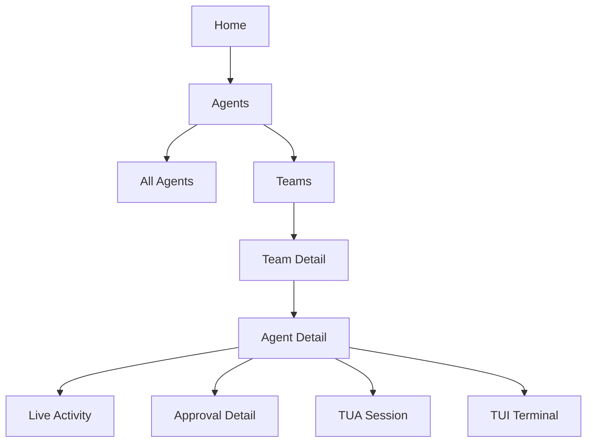

# Teams And Agent Grouping

## Purpose

Agents is the primary v1 UI term. Teams are optional groups that help users organize agents across nodes without hiding source identity.

Teams are a mobile operator UX feature, not a replacement for nodes, gateways, agents, or sessions.

## Product Decisions

- Use "Agents" as the primary v1 tab and entity term.
- Add "Teams" as optional grouping under Agents.
- Preserve node/source context everywhere.
- Allow an agent to appear in zero, one, or many Teams.
- Keep single-node, single-agent operation simple when no Teams exist.

## Team Model

A Team represents a user-defined or gateway-suggested group of agents.

Examples:

- Homelab
- Coding
- Research
- Work VM
- Browser Agents
- Critical Infrastructure

Team fields:

- `team_id`
- `display_name`
- `description`
- `color`
- `icon`
- `sort_order`
- `created_at`
- `updated_at`

Agent membership fields:

- `team_id`
- `node_id`
- `agent_id`
- `role`
- `added_at`

## UX Requirements

Agents tab must support:

- individual agents
- Teams grouping
- node/source context
- capabilities
- current status
- active task
- pending approvals
- recent notifications

Home should show Team-level rollups only when useful. Team rollups must not hide high-risk or critical state from individual agents.

## Navigation

## Identity Rules

- `agent_id` is unique only within `node_id`.
- Team membership must store both `node_id` and `agent_id`.
- UI labels must disambiguate agents with identical display names.
- Actions launched from Team context must show node/source context before execution.
- Team filters must not merge approvals, audit records, or sessions across nodes.

## Team Health Rollups

Team status can be derived from member agents:

| Rollup State | Meaning |
| --- | --- |
| `critical` | Any member has critical approval, security alert, quarantine, or stop condition |
| `blocked` | Any member is blocked or waiting on user |
| `active` | One or more members are running |
| `idle` | All reachable members are idle |
| `degraded` | One or more source nodes are unreachable |

Rollup state is a summary only. The source agent state remains authoritative.

## Planned API Surface

- `GET /v1/teams`
- `POST /v1/teams`
- `GET /v1/teams/{team_id}`
- `PATCH /v1/teams/{team_id}`
- `DELETE /v1/teams/{team_id}`
- `POST /v1/teams/{team_id}/agents`
- `DELETE /v1/teams/{team_id}/agents/{node_id}/{agent_id}`

## Safety Notes

- Teams cannot grant permissions.
- Teams cannot broaden an approval scope by themselves.
- Team-level stop controls must enumerate target agents before confirmation.
- Team-level notification rollups must link back to concrete notification records.
- Team-level policies, if added later, must still bind to node and agent identity.
