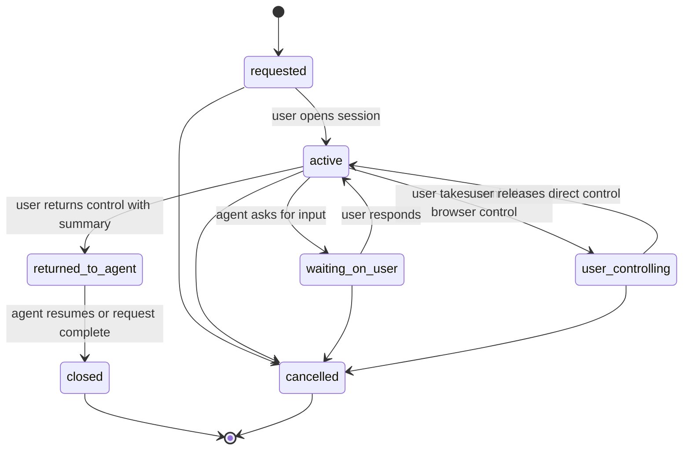
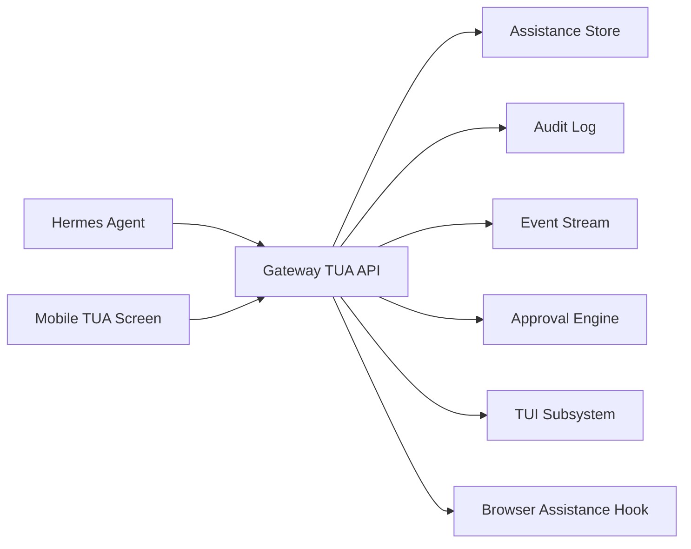
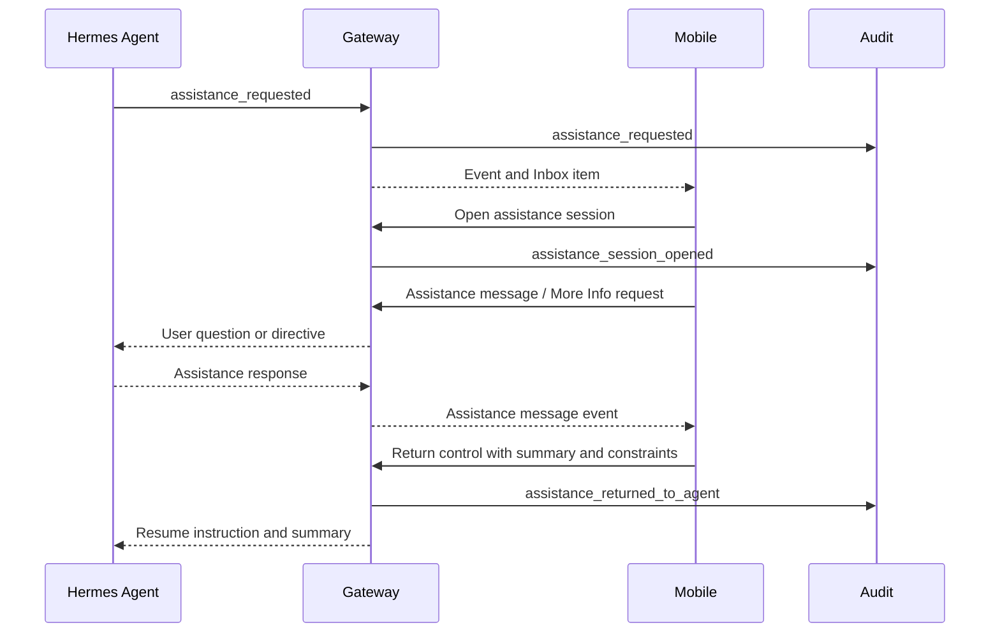

# TUA Architecture

## Purpose

TUA means Take User Assistance. It is the workflow where Hermes asks the user for help, the user collaborates with the agent inside a bounded assistance context, and control returns to the agent with a clear summary.

TUA is distinct from ordinary chat and distinct from approval decisions. It can be opened from an approval, notification, mission, live activity screen, or agent request.

## Goals

- Let an agent ask for help without executing blocked work.
- Let the user ask for more information before deciding.
- Support partial approvals and modified directives.
- Allow terminal or browser assistance when needed.
- Preserve node, agent, session, approval, and mission context.
- Provide an explicit return-control handoff.
- Audit assistance lifecycle and handoff events.

## Non-Goals

- Replacing normal Hermes chat.
- Making assistance chat an approval by itself.
- Allowing TUA messages to bypass approval policy.
- Running terminal or browser intervention without signed mobile authorization.

## TUA Session States

State definitions:

- `requested`: Agent or user has requested assistance but no active session is open.
- `active`: User and agent can exchange assistance messages.
- `waiting_on_user`: Agent needs user input.
- `user_controlling`: User has taken terminal or browser control.
- `returned_to_agent`: User has handed back control with a summary or directive.
- `closed`: Assistance ended normally.
- `cancelled`: Assistance no longer applies.

## High-Level Architecture

## Data Flow: Assistance Request To Return Control

## Assistance Entry Points

- Approval card More menu.
- More Info drill-down.
- Inbox assistance request.
- Live Activity blocked state.
- Agent Detail current task.
- Mission detail.
- Notification deep link.

## Assistance Capabilities

Required TUA capabilities:

- Create assistance request.
- List assistance requests.
- Open assistance session.
- Send assistance message.
- Attach approval context.
- Attach terminal context.
- Attach browser context.
- Ask for more information.
- Submit partial approval or modified directive.
- Pause or resume agent.
- Return control to agent.
- Close assistance session.

## Return-Control Contract

Returning control must include:

- `assistance_session_id`
- `node_id`
- `agent_id`
- `session_id`
- user summary
- optional constraints
- optional linked approval response
- optional terminal session summary
- optional browser assistance summary
- deciding device identity
- timestamp

The agent should resume only from the explicit return-control payload, not from arbitrary chat messages.

## Security Requirements

- Assistance messages must be scoped to one node, agent, and session.
- Assistance sessions linked to approvals must not approve actions implicitly.
- Terminal or browser assistance requires the same signed-device controls as direct intervention.
- Return-control events must be audited.
- Raw payload expansion should require explicit user action and remain redacted.

## Planned API Surface

- `POST /v1/tua/requests`
- `GET /v1/tua/requests`
- `GET /v1/tua/requests/{request_id}`
- `POST /v1/tua/requests/{request_id}/sessions`
- `GET /v1/tua/sessions/{session_id}`
- `POST /v1/tua/sessions/{session_id}/messages`
- `POST /v1/tua/sessions/{session_id}/return-control`
- `POST /v1/tua/sessions/{session_id}/close`

Browser help is modeled as its own thin subsystem:

- `POST /v1/browser-assistance/sessions`
- `GET /v1/browser-assistance/sessions`
- `GET /v1/browser-assistance/sessions/{session_id}`
- `POST /v1/browser-assistance/sessions/{session_id}/event`
- `POST /v1/browser-assistance/sessions/{session_id}/return-control`
- `POST /v1/browser-assistance/sessions/{session_id}/close`

## Mobile UX Notes

- Friendly summary appears before technical detail.
- Linked approval card remains visible as context.
- TUI and browser assistance launch as contextual tools, not separate tasks.
- Return control requires a user-visible summary.
- Closing a TUA session does not automatically approve or deny a linked approval.
