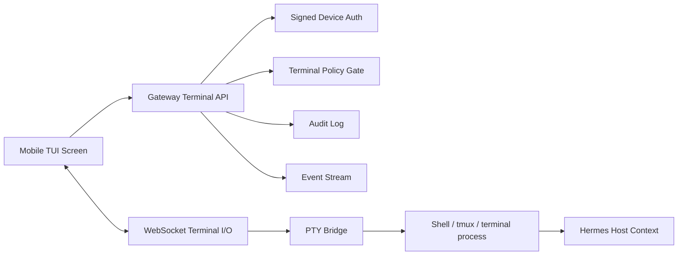
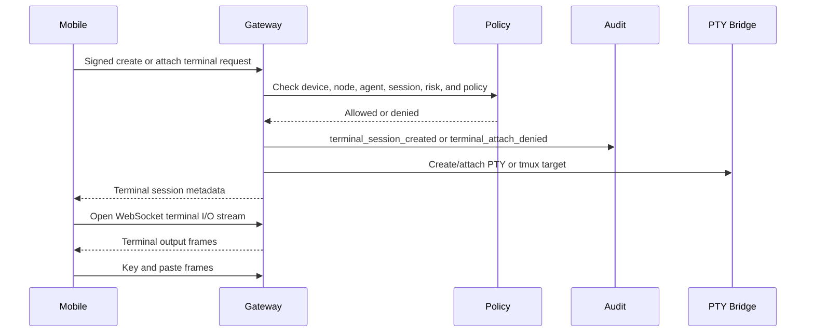

# TUI Architecture

## Purpose

TUI means Text User Interface. In Hermes Mobile Control Plane it is a real mobile terminal subsystem for operator intervention, not a log viewer.

The TUI exists so a mobile user can inspect, edit, run, recover, and hand work back to Hermes without needing a laptop.

## Goals

- Provide real terminal sessions from mobile.
- Preserve node, agent, session, and assistance context.
- Support attach/detach so users can leave and return without killing work.
- Support tmux-oriented workflows where the Hermes host already uses tmux.
- Make mobile copy/paste safe and ergonomic.
- Audit terminal creation, attach, detach, close, key events, paste events, and permission denials.

## Non-Goals

- Replacing full desktop terminal ergonomics.
- Bypassing gateway approval policy.
- Sending unredacted terminal data to push notifications.
- Requiring public network exposure.
- Implementing browser takeover inside the terminal subsystem.

## User Capabilities

Required TUI capabilities:

- Create terminal session.
- Attach to terminal session.
- Detach from terminal session.
- Close terminal session.
- Stream terminal output.
- Send key event.
- Send paste payload.
- Support mobile copy and long-press multi-select.
- Support paste-only, paste-and-execute, and paste-as-file.
- Handle multi-line paste safely.
- Show agent-aware terminal header.
- Support iPad split-view and external keyboards.
- Support Android keyboard behavior.

## Terminal Session Model

Terminal sessions are linked to:

- `node_id`
- `agent_id`
- `session_id`
- optional `approval_id`
- optional `assistance_session_id`
- `created_by_device_id`
- state: `starting`, `active`, `detached`, `closed`, `failed`

The gateway is the durable source for session metadata. Terminal byte streams may be retained only within configured retention limits.

## High-Level Architecture

## Data Flow: Attach Terminal

## Mobile Special Key Bar

The terminal accessory bar has four pages.

Page 1:

- ESC
- TAB
- CTRL
- ALT
- CMD
- arrows

Page 2:

- `/`
- `~`
- `|`
- `&`
- `$`
- `;`
- `:`

Page 3:

- `{ }`
- `[ ]`
- `( )`
- `< >`

Page 4:

- F1-F12
- Home
- End
- PgUp
- PgDn

## Copy/Paste UX

Copy affordances:

- One-tap copy for commands.
- One-tap copy for paths.
- One-tap copy for URLs.
- One-tap copy for logs.
- One-tap copy for errors.
- Long-press multi-select for terminal text.

Paste affordances:

- Paste into prompt.
- Paste and execute.
- Paste as file.
- Paste with confirmation when content is multi-line.
- Paste blocked or warned when content contains suspicious control characters or secret-looking strings.

## Security Requirements

- Terminal actions require signed device requests.
- Terminal sessions must preserve node, agent, and session context.
- Terminal paste events must be audited with redacted metadata, not raw secrets.
- TUI must not silently approve risky terminal actions.
- Terminal sessions created from approval or TUA contexts must remain linked to that context.
- Terminal access can be disabled by gateway policy for high-risk nodes or untrusted devices.

## Mobile Success Criterion

A user must be able to complete this Git workflow from mobile without needing a laptop:

1. Inspect status.
2. Review diff.
3. Edit a file.
4. Run tests.
5. Commit.
6. Push.

## Planned API Surface

- `POST /v1/tui/sessions`
- `GET /v1/tui/sessions`
- `GET /v1/tui/sessions/{session_id}`
- `POST /v1/tui/sessions/{session_id}/detach`
- `POST /v1/tui/sessions/{session_id}/close`
- `GET /v1/tui/sessions/{session_id}/stream`

Terminal input, paste, resize, detach, and close frames ride over the WebSocket
stream in the first prototype instead of separate REST endpoints. REST controls
remain signed paired-device requests. The WebSocket stream currently uses the
paired device access token after the session has been created by a signed
request; production hardening should replace that with a short-lived attach
token minted through a signed request.

## Prototype Safety Gate

The first local PTY runner is development-only:

- Disabled unless `HERMES_TUI_ENABLE_LOCAL_PTY=1`.
- Requires an explicit command allowlist.
- Enforces an allowed working directory root.
- Limits concurrent sessions.
- Applies idle timeout cleanup.
- Audits session creation, detach, close, input metadata, and paste metadata.
- Does not log full terminal contents by default.

## Open Questions For Implementation Slices

- When to graduate from development-only direct PTY to hardened tmux/session broker.
- How much terminal output should be retained for backfill.
- Whether terminal stream authorization should use a short-lived attach token in addition to signed setup requests.
- How paste-as-file chooses destination and confirms overwrite behavior.
