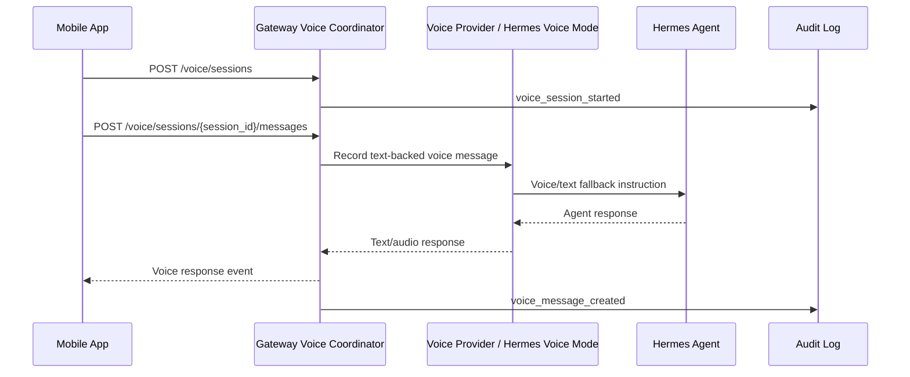

# Voice Architecture

## Purpose

Voice support should extend Hermes Mobile Control Plane after core monitoring, chat, approvals, and intervention are reliable. The architecture must support push-to-talk MVP first, then half-duplex and full-duplex modes, while preserving approval safety.

## Modes

| Mode | Description | Pros | Cons | Recommended Phase |
| --- | --- | --- | --- | --- |
| Push-to-talk | User records bounded audio clips and sends them to Hermes | Simple, controllable, good mobile UX | Not conversational in real time | MVP voice |
| Half-duplex | User and agent alternate speaking turns | Lower complexity than full duplex | Interruptions are clunky | Phase 2 |
| Full duplex | Continuous bidirectional audio conversation | Best live experience | Requires WebRTC/media pipeline and echo handling | Phase 3 |
| WebRTC media | Low-latency audio transport with data channels | Best for live voice and future screen/browser streaming | Signaling and permissions are complex | Phase 3 foundation |

## Recommended Phases

### MVP: Push-To-Talk

Scope:

- Mobile push-to-talk recording
- Audio upload to gateway
- Gateway bridge to Hermes voice mode or transcription provider
- Agent response as text plus optional synthesized audio
- Voice session audit entries
- No voice approvals for consequential actions

Acceptance:

- User can send a voice instruction to an active session.
- User can receive text response and optional audio response.
- Voice session can be tied to node, agent, and session.
- App works if voice is unavailable.

### Phase 2: Half-Duplex Voice

Scope:

- Turn-based live voice session
- Agent speech playback
- Interrupt button
- Push notification category `voice_callback`
- Optional voice approval preview, but not final approval without confirmation phrase

Acceptance:

- User and agent can alternate voice turns.
- User can interrupt and return to text controls.
- Voice events are reflected in live activity.

### Phase 3: Full Duplex And Voice Approval

Scope:

- WebRTC full-duplex session
- Voice activity detection
- Barge-in / interruption
- Voice approval with required confirmation phrase
- Optional browser/screen realtime side channel

Acceptance:

- User can maintain a continuous conversation.
- User can approve by voice only after a second explicit confirmation phrase.
- Voice approval produces the same signed decision structure as touch approval.

## Integration Options

| Integration | Role | Notes |
| --- | --- | --- |
| Hermes voice mode | Primary existing Hermes voice bridge | Preferred integration point when available |
| XTTS | Text-to-speech option | Useful for local or self-hosted voice output |
| OmniVoice | Future or alternate voice provider | Treat as provider behind gateway interface |
| Future providers | STT/TTS/voice model providers | Must implement the same gateway voice adapter contract |

## Voice Session Flow

## Voice Approval Safety

Voice approval must not bypass the approval framework.

Requirements:

- Voice approval maps to a normal approval decision.
- The mobile app must show or speak the approval summary.
- User must provide an explicit confirmation phrase.
- Gateway verifies the same device signature as touch approvals.
- Critical approvals may require touch confirmation even in voice mode.
- Voice transcripts used for approval are audit logged with redaction.

## Transport

- MVP uses authenticated HTTP upload/download for bounded audio turns.
- Phase 2 may use WebSocket for turn events and audio chunks.
- Phase 3 uses WebRTC for continuous media and optional data channel.

## Failure Modes

- Network loss: end or pause voice session and keep text controls available.
- STT failure: show transcript failure and request retry.
- TTS failure: fall back to text response.
- Provider unavailable: mark voice capability degraded.
- Ambiguous approval phrase: deny approval submission and ask for explicit confirmation.
