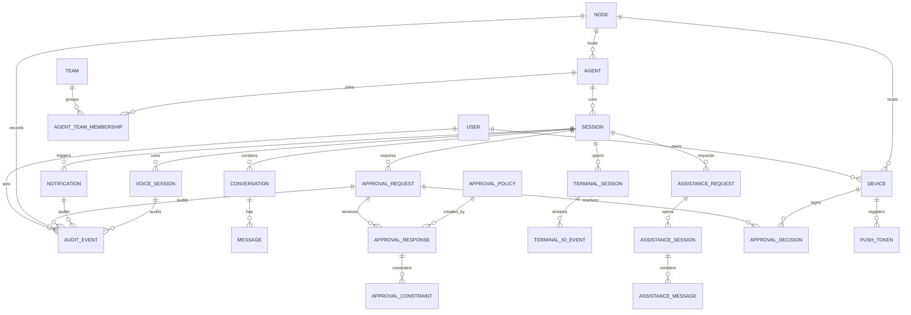

# Data Model

## Purpose

This data model defines the durable records needed by the Hermes Control Gateway and mobile clients. It is implementation-ready but storage-engine neutral.

## Entity Relationship Diagram

## Entity Definitions

### User

MVP may use a single implicit owner, but a user entity keeps the model ready for multi-user support.

| Field | Type | Required | Notes |
| --- | --- | --- | --- |
| `user_id` | string | yes | Stable ID |
| `display_name` | string | yes | User-facing name |
| `role` | enum | yes | `owner`, `operator`, `viewer` |
| `status` | enum | yes | `active`, `disabled` |
| `created_at` | datetime | yes | Creation time |

### Node

Represents one Hermes install and its gateway.

| Field | Type | Required | Notes |
| --- | --- | --- | --- |
| `node_id` | string | yes | Stable gateway/node ID |
| `display_name` | string | yes | User label |
| `environment` | enum | yes | `homelab`, `laptop`, `cloud`, `workstation`, `vps`, `work_vm`, `custom` |
| `gateway_base_url` | string | yes | Tailscale/local/relay address |
| `node_fingerprint` | string | yes | Shown during pairing |
| `gateway_version` | string | yes | Capability compatibility |
| `hermes_version` | string | no | Runtime compatibility |
| `health` | enum | yes | `online`, `degraded`, `offline`, `unknown` |
| `tags` | string array | no | User-defined filters |
| `created_at` | datetime | yes | Registration time |
| `last_seen_at` | datetime | no | Last successful contact |

### Agent

Represents a Hermes agent registered under one node.

| Field | Type | Required | Notes |
| --- | --- | --- | --- |
| `agent_id` | string | yes | Unique within node |
| `node_id` | string | yes | Parent node |
| `display_name` | string | yes | User-facing name |
| `agent_kind` | string | no | `primary`, `subagent`, `voice`, custom |
| `status` | enum | yes | `idle`, `running`, `blocked`, `paused`, `stopping`, `offline`, `error`, `quarantined` |
| `capabilities` | object array | yes | Capability name/status |
| `tags` | string array | no | User or gateway assigned |
| `active_session_id` | string | no | Current session |
| `current_tool` | string | no | Current tool name |
| `current_target` | string | no | Current target/resource |
| `last_seen_at` | datetime | yes | Health timestamp |

### Team

Optional grouping for agents. Teams help mobile users organize agents without replacing node identity.

| Field | Type | Required | Notes |
| --- | --- | --- | --- |
| `team_id` | string | yes | Stable team ID |
| `display_name` | string | yes | User-facing label |
| `description` | string | no | Optional purpose or scope |
| `color` | string | no | UI hint |
| `icon` | string | no | UI hint |
| `sort_order` | integer | no | User-defined ordering |
| `created_at` | datetime | yes | Creation time |
| `updated_at` | datetime | yes | Last update |

### AgentTeamMembership

Links an agent to a Team while preserving node/source identity.

| Field | Type | Required | Notes |
| --- | --- | --- | --- |
| `team_id` | string | yes | Parent Team |
| `node_id` | string | yes | Source node |
| `agent_id` | string | yes | Source agent |
| `role` | string | no | Optional role such as `primary`, `support`, `observer` |
| `added_at` | datetime | yes | Membership time |

### Device

Represents a trusted mobile app installation.

| Field | Type | Required | Notes |
| --- | --- | --- | --- |
| `device_id` | string | yes | Stable registered device ID |
| `user_id` | string | yes | Owner/operator |
| `node_id` | string | yes | Trust is node-scoped in MVP |
| `device_name` | string | yes | User-facing label |
| `platform` | enum | yes | `ios`, `android` |
| `device_public_key` | string | yes | Verifies approvals/interventions |
| `status` | enum | yes | `active`, `revoked`, `lost`, `rotating`, `disabled` |
| `permissions` | enum array | yes | `read_state`, `chat`, `approve`, `intervene`, `manage_devices`, `voice`, `tui`, `browser_assist` |
| `registered_at` | datetime | yes | Pairing time |
| `last_seen_at` | datetime | no | Last API use |

### PushToken

| Field | Type | Required | Notes |
| --- | --- | --- | --- |
| `push_token_id` | string | yes | Stable internal ID |
| `device_id` | string | yes | Owning device |
| `platform` | enum | yes | `apns`, `fcm` |
| `token_hash` | string | yes | Store hash for audit/dedupe |
| `encrypted_token` | string | yes | Encrypted dispatch token |
| `status` | enum | yes | `active`, `revoked`, `expired`, `failed` |
| `created_at` | datetime | yes | Creation time |
| `last_used_at` | datetime | no | Last dispatch attempt |

### Session

| Field | Type | Required | Notes |
| --- | --- | --- | --- |
| `session_id` | string | yes | Hermes session ID |
| `node_id` | string | yes | Parent node |
| `agent_id` | string | yes | Active agent |
| `conversation_id` | string | no | Related conversation |
| `status` | enum | yes | `active`, `blocked`, `paused`, `completed`, `failed`, `cancelled` |
| `title` | string | no | Display title |
| `summary` | string | no | Redacted summary |
| `current_plan` | string | no | Current plan summary |
| `current_tool` | string | no | Current tool |
| `current_target` | string | no | Current target |
| `started_at` | datetime | yes | Start time |
| `updated_at` | datetime | yes | Last update |
| `ended_at` | datetime | no | End time |

### Conversation

| Field | Type | Required | Notes |
| --- | --- | --- | --- |
| `conversation_id` | string | yes | Stable ID |
| `node_id` | string | yes | Parent node |
| `session_id` | string | no | Active or latest session |
| `title` | string | no | Display title |
| `created_at` | datetime | yes | Creation time |
| `updated_at` | datetime | yes | Last message/update |

### Message

| Field | Type | Required | Notes |
| --- | --- | --- | --- |
| `message_id` | string | yes | Stable ID |
| `conversation_id` | string | yes | Parent conversation |
| `role` | enum | yes | `user`, `assistant`, `system`, `tool` |
| `content` | string | yes | Redacted where required |
| `redacted` | boolean | yes | Whether content was redacted |
| `created_at` | datetime | yes | Message time |

### ApprovalRequest

| Field | Type | Required | Notes |
| --- | --- | --- | --- |
| `approval_id` | string | yes | Stable approval ID |
| `action_id` | string | yes | Underlying tool/action ID |
| `node_id` | string | yes | Node scope |
| `agent_id` | string | yes | Agent scope |
| `session_id` | string | yes | Session scope |
| `requested_tool` | string | yes | Tool/action requested |
| `risk_level` | enum | yes | `low`, `medium`, `high`, `critical` |
| `risk_category` | string | yes | Policy category |
| `summary` | string | yes | Human-readable redacted summary |
| `full_payload_redacted` | object | yes | Redacted payload |
| `payload_hash` | string | yes | Hash of canonical original payload |
| `resource_scope` | string | yes | Files, repo, URL, account, or other scope |
| `state` | enum | yes | `pending`, `approved`, `denied`, `expired`, `cancelled` |
| `options` | enum array | yes | Allowed decisions |
| `requested_at` | datetime | yes | Request time |
| `expires_at` | datetime | yes | Expiry |

### ApprovalDecision

| Field | Type | Required | Notes |
| --- | --- | --- | --- |
| `decision_id` | string | yes | Idempotency key |
| `approval_id` | string | yes | Parent approval |
| `device_id` | string | yes | Signing device |
| `user_id` | string | no | Future multi-user |
| `decision` | enum | yes | `approve`, `deny` |
| `scope` | enum | yes | `once`, `session`, `agent`, `permanent` |
| `control` | enum | no | `pause`, `kill_task`, `kill_agent`, `quarantine_agent` |
| `signed_payload_hash` | string | yes | Hash of signed body |
| `signature` | string | yes | Device signature |
| `created_at` | datetime | yes | Decision time |

### ApprovalResponse

Records advanced mobile approval intent. It can produce a terminal approval state or keep the approval pending while the user asks for more information, opens TUA, opens TUI, or sends a modified directive.

| Field | Type | Required | Notes |
| --- | --- | --- | --- |
| `approval_response_id` | string | yes | Stable response ID |
| `approval_id` | string | yes | Parent approval |
| `decision_type` | enum | yes | `approve_once`, `approve_session`, `approve_agent`, `deny`, `modified`, `needs_info`, `propose_policy` |
| `user_message` | string | no | User instruction or explanation, redacted where needed |
| `alternate_directive` | string | no | Alternate action proposed by user |
| `policy_proposal_id` | string | no | Proposal created by Approve Forever |
| `created_by_device_id` | string | yes | Signing device |
| `created_at` | datetime | yes | Response time |

### ApprovalConstraint

Constraint attached to an advanced approval response.

| Field | Type | Required | Notes |
| --- | --- | --- | --- |
| `approval_constraint_id` | string | yes | Stable constraint ID |
| `approval_response_id` | string | yes | Parent response |
| `constraint_type` | enum | yes | `directory_scope`, `read_only_first`, `deny_auth_changes`, `ask_before_write`, `tests_only`, `tool_allowlist`, `custom` |
| `value_redacted` | object | yes | Constraint value with sensitive content removed |
| `created_at` | datetime | yes | Creation time |

### ApprovalPolicy

Persistent or proposed policy created by Approve Forever.

| Field | Type | Required | Notes |
| --- | --- | --- | --- |
| `approval_policy_id` | string | yes | Stable policy ID |
| `node_id` | string | yes | Node scope |
| `agent_id` | string | no | Agent scope if policy is agent-specific |
| `tool_name` | string | yes | Tool/action class |
| `risk_category` | string | yes | Policy category |
| `resource_scope` | string | no | Files, URLs, repo, account, or other scope |
| `constraints` | object array | no | Policy constraints |
| `status` | enum | yes | `proposed`, `active`, `revoked`, `expired` |
| `created_by_device_id` | string | yes | Device that proposed or created policy |
| `created_at` | datetime | yes | Creation time |
| `expires_at` | datetime | no | Optional expiry |

### Notification

| Field | Type | Required | Notes |
| --- | --- | --- | --- |
| `notification_id` | string | yes | Stable ID |
| `node_id` | string | yes | Node scope |
| `agent_id` | string | yes | Agent scope |
| `session_id` | string | yes | Session scope |
| `action_id` | string | no | Related action |
| `category` | enum | yes | `approval_required`, `security_alert`, `agent_blocked`, `task_complete`, `system_health`, `voice_callback` |
| `urgency` | enum | yes | `low`, `normal`, `high`, `critical` |
| `title_safe` | string | yes | Secret-free title |
| `body_safe` | string | yes | Secret-free body |
| `dedupe_key` | string | no | Collapse key |
| `state` | enum | yes | `queued`, `dispatched`, `rate_limited`, `deduped`, `failed`, `opened` |
| `created_at` | datetime | yes | Request time |
| `last_attempt_at` | datetime | no | Dispatch time |

### AuditEvent

| Field | Type | Required | Notes |
| --- | --- | --- | --- |
| `audit_event_id` | string | yes | Stable ID |
| `event_type` | string | yes | Auth, approval, notification, intervention, policy, voice, etc. |
| `node_id` | string | yes | Node scope |
| `agent_id` | string | no | Agent scope |
| `session_id` | string | no | Session scope |
| `actor_type` | enum | yes | `device`, `user`, `gateway`, `agent`, `system` |
| `actor_id` | string | no | Device/user/agent ID |
| `target_type` | string | no | Approval, notification, session, device |
| `target_id` | string | no | Target ID |
| `payload_redacted` | object | no | Redacted audit payload |
| `hash` | string | yes | Event integrity hash |
| `previous_hash` | string | no | Chain hash for tamper evidence |
| `created_at` | datetime | yes | Event time |

### TuiSession

Real terminal session for mobile TUI.

| Field | Type | Required | Notes |
| --- | --- | --- | --- |
| `session_id` | string | yes | Stable TUI session ID |
| `agent_id` | string | yes | Related agent |
| `node_id` | string | yes | Source node |
| `user_device_id` | string | yes | Device that opened terminal |
| `state` | enum | yes | `requested`, `active`, `detached`, `closed`, `failed` |
| `command` | string | yes | Allowlisted command path |
| `working_directory` | string | yes | Directory constrained by gateway policy |
| `risk_level` | enum | yes | Terminal session risk level |
| `risk_label` | string | yes | User-facing terminal risk label |
| `output_retention_enabled` | boolean | yes | Whether output retention is enabled; false by default |
| `audit_refs` | array | yes | Related audit event IDs |
| `created_at` | datetime | yes | Creation time |
| `last_activity_at` | datetime | yes | Last input, attach, detach, or close activity |
| `closed_at` | datetime | no | Close time |

### TerminalIOEvent

Terminal input/output metadata for TUI stream backfill and audit.

| Field | Type | Required | Notes |
| --- | --- | --- | --- |
| `terminal_io_event_id` | string | yes | Stable event ID |
| `session_id` | string | yes | Parent TUI session |
| `direction` | enum | yes | `input`, `output` |
| `event_type` | enum | yes | `bytes`, `key`, `paste`, `resize`, `attach`, `detach` |
| `payload_redacted` | object | no | Redacted or summarized payload |
| `byte_count` | integer | no | Size metadata |
| `created_at` | datetime | yes | Event time |

### AssistanceRequest

Agent-originated or user-originated request for Take User Assistance.

| Field | Type | Required | Notes |
| --- | --- | --- | --- |
| `assistance_request_id` | string | yes | Stable request ID |
| `node_id` | string | yes | Source node |
| `agent_id` | string | yes | Source agent |
| `session_id` | string | yes | Source session |
| `approval_id` | string | no | Linked approval |
| `reason` | string | yes | Redacted assistance reason |
| `state` | enum | yes | `requested`, `active`, `closed`, `cancelled` |
| `created_at` | datetime | yes | Creation time |
| `expires_at` | datetime | no | Optional expiry |

### AssistanceSession

Active TUA session.

| Field | Type | Required | Notes |
| --- | --- | --- | --- |
| `assistance_session_id` | string | yes | Stable session ID |
| `assistance_request_id` | string | yes | Parent request |
| `node_id` | string | yes | Source node |
| `agent_id` | string | yes | Source agent |
| `session_id` | string | yes | Source Hermes session |
| `state` | enum | yes | `requested`, `active`, `waiting_on_user`, `user_controlling`, `returned_to_agent`, `closed`, `cancelled` |
| `opened_by_device_id` | string | yes | Device that opened session |
| `return_summary` | string | no | User summary on handoff |
| `created_at` | datetime | yes | Creation time |
| `updated_at` | datetime | yes | Last update |
| `closed_at` | datetime | no | Close time |

### AssistanceMessage

Message inside a TUA session.

| Field | Type | Required | Notes |
| --- | --- | --- | --- |
| `assistance_message_id` | string | yes | Stable message ID |
| `assistance_session_id` | string | yes | Parent TUA session |
| `sender_type` | enum | yes | `user`, `agent`, `gateway`, `system` |
| `sender_id` | string | no | Device, user, agent, or gateway ID |
| `message_type` | enum | yes | `message`, `more_info`, `directive`, `return_control`, `context_attachment` |
| `content_redacted` | string | yes | Redacted message content |
| `created_at` | datetime | yes | Message time |

### VoiceSession

| Field | Type | Required | Notes |
| --- | --- | --- | --- |
| `voice_session_id` | string | yes | Stable ID |
| `node_id` | string | yes | Node scope |
| `agent_id` | string | yes | Agent scope |
| `session_id` | string | yes | Parent session |
| `device_id` | string | yes | Initiating device |
| `mode` | enum | yes | `push_to_talk`, `half_duplex`, `full_duplex` |
| `provider` | string | no | Hermes voice, XTTS, OmniVoice, etc. |
| `state` | enum | yes | `starting`, `active`, `paused`, `ended`, `failed` |
| `started_at` | datetime | yes | Start time |
| `ended_at` | datetime | no | End time |

## Retention Recommendations

| Entity | Recommended Retention | Notes |
| --- | --- | --- |
| User | Until deleted or disabled | Preserve audit actor references |
| Device | Active plus 1 year after revocation | Keep public key metadata for audit verification |
| PushToken | Until revoked plus 90 days | Store encrypted token; hash retained for audit |
| Node | Until removed plus 1 year | Preserve audit references |
| Agent | Until node removed plus 1 year | Stale agents marked, not immediately deleted |
| Team | Until deleted plus 1 year | Preserve grouping context for audit history |
| AgentTeamMembership | Until removed plus 1 year | Preserve source context for Team actions |
| Session | 90 days default, configurable | Longer if user wants history |
| Conversation | 90 days default, configurable | Redaction policy applies |
| Message | 90 days default, configurable | Avoid retaining sensitive raw tool output by default |
| ApprovalRequest | 1 year minimum | Safety-critical auditability |
| ApprovalDecision | 1 year minimum | Needed for forensic review |
| ApprovalResponse | 1 year minimum | Needed for advanced approval auditability |
| ApprovalConstraint | 1 year minimum | Needed to verify conditional approvals |
| ApprovalPolicy | Until revoked plus 1 year | Keep history of policy creation and revocation |
| Notification | 90 days | Dispatch history and abuse review |
| AuditEvent | 1 year minimum; 7 years optional | Local self-hosted owner controls final retention |
| TuiSession | 30 days metadata; configurable | Terminal output may contain sensitive data |
| TerminalIOEvent | Short retention by default | Retain metadata longer than raw stream content |
| AssistanceRequest | 90 days default | Preserve help request context |
| AssistanceSession | 90 days default | Preserve return-control summary |
| AssistanceMessage | 90 days default; configurable | Redaction policy applies |
| VoiceSession | 30 days metadata; audio/transcripts shorter | Audio may contain sensitive data |

## Storage Notes

- Store raw secrets only where Hermes already requires them; gateway should prefer redacted payloads and hashes.
- Audit events should be append-only and hash chained.
- Approval payload hash should bind the original canonical payload even when mobile sees only redacted content.
- Event stream retention can be shorter than audit retention.
- Mobile app may cache node inventory and recent state, but gateway is durable source of truth.
