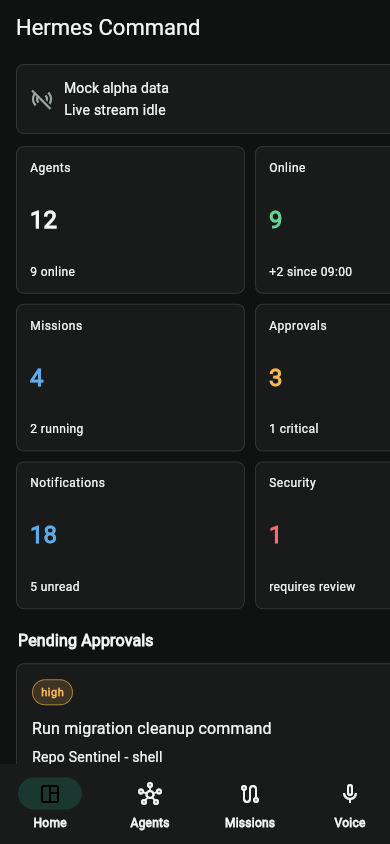
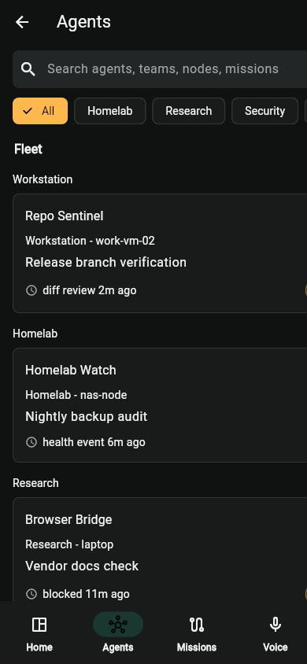
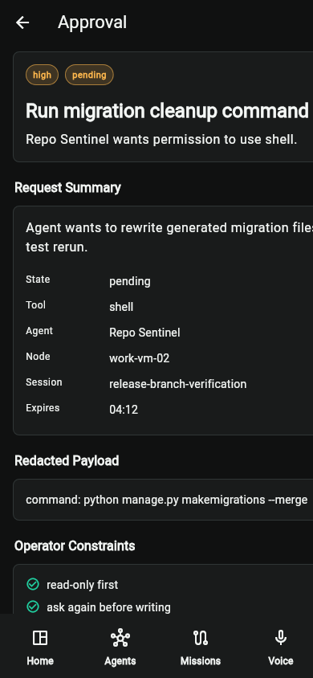
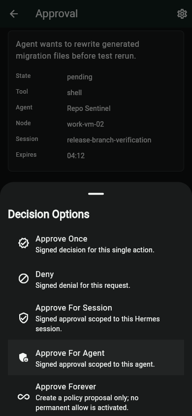
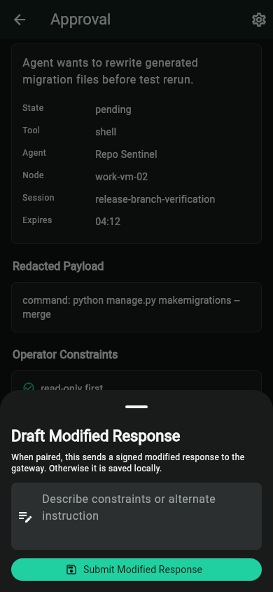
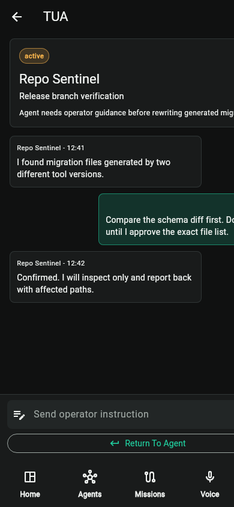
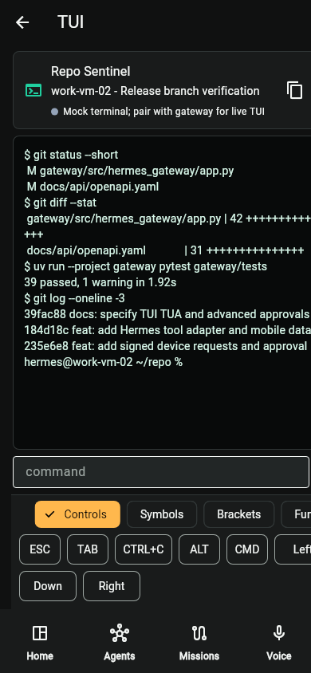
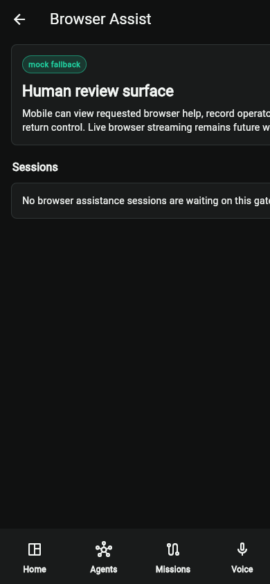
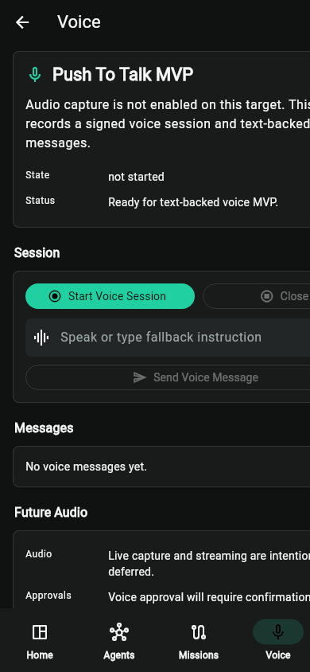
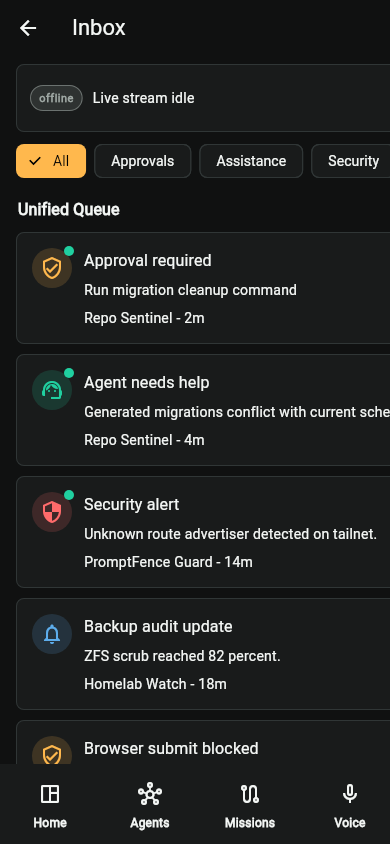

# Demo Gallery

Sprint: `HERMES-MCP-PLATFORM-CONSOLIDATION-006`

Captured from the Flutter Chrome target at `http://127.0.0.1:53100`.

## Home

Purpose: Fleet overview with agent count, online agents, missions, approvals, notifications, and security alerts.

Current status: Works as the command-center entry point with mock alpha data and visible stream status.

Known limitations: Needs stronger gateway-backed fleet data and tablet layout.

## Agents

Purpose: Searchable agent inventory with status, team, mission, and last activity.

Current status: Shows operator-useful density and supports team-oriented scanning.

Known limitations: Team is currently a grouping model, not a durable policy owner.

## Team Grouping

Purpose: Demonstrates how agents can be grouped by operational team while retaining node/source context.

Current status: Useful for homelab, workstation, and research groupings.

Known limitations: Needs explicit UI language that teams are organizational metadata.

## Approval Detail

Purpose: Shows a pending approval with risk, agent, node, session, expiry, payload, constraints, and decision controls.

Current status: Good safety context and signed decision integration.

Known limitations: Primary actions should become sticky so they remain reachable on smaller screens.

## More Menu

Purpose: Advanced approval decisions and intervention entry points.

Current status: Contains the correct action set, including signed scopes and policy proposal behavior.

Known limitations: Needs grouping into Decision, Assistance, Policy, and Emergency sections.

## Modified Approval

Purpose: Drafts a modified response or alternate instruction instead of approving the original action as-is.

Current status: Supports the product's strongest safety nuance: "change the instruction rather than blindly approve."

Known limitations: Needs reusable constraint chips and clearer enforcement feedback.

## TUA

Purpose: Take User Assistance timeline where an operator can help the agent and return control.

Current status: Works as a realistic assistance flow and can be opened from approval context.

Known limitations: Needs shared OperatorSession status language and stronger mission context.

## TUI

Purpose: Terminal interaction prototype with scrollback, input, paste, and mobile keyboard accessory controls.

Current status: Gateway-backed TUI exists when development PTY is enabled; mock fallback remains available.

Known limitations: Still development-only and requires more hardening before production shell access.

## Browser Assistance

Purpose: Thin browser-assistance session for operator notes and return-control flow.

Current status: Useful as a browser-context assistance log.

Known limitations: No live browser screenshot, stream, or direct browser control yet.

## Voice

Purpose: Text-backed voice MVP with future push-to-talk/live-audio direction.

Current status: Functional enough to record voice-session messages without an external STT/TTS provider.

Known limitations: No native audio recording or streaming voice yet.

## Inbox

Purpose: Unified attention surface for notifications, approvals, and assistance requests.

Current status: Correct mental model for mobile operator triage.

Known limitations: Needs stronger type filters, unread handling, and live event affordances.
