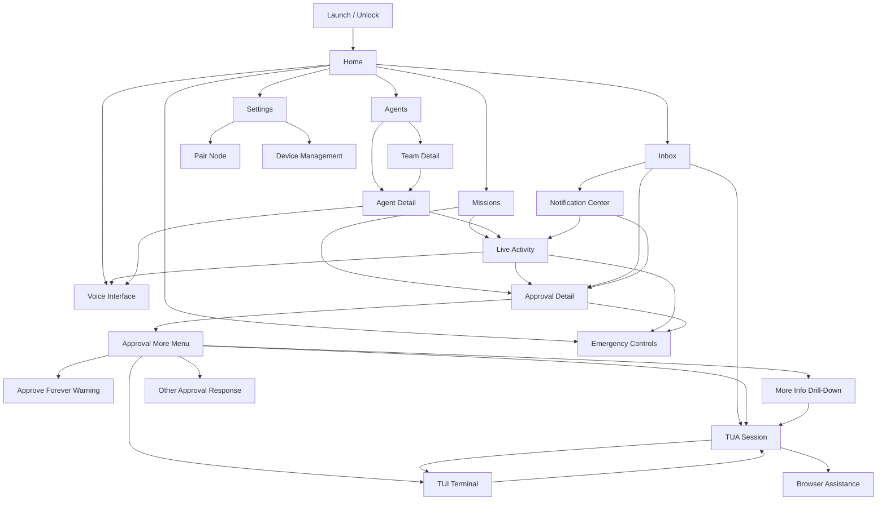

# Mobile UX Architecture

## Purpose

This document defines the mobile app's screen inventory, navigation model, and state contracts. It intentionally avoids UI polish, branding, and visual design details.

## UX Principles

- Every action must preserve visible node, agent, and session context.
- Approval and emergency controls must be reachable without hunting through settings.
- Push notifications deep link to durable gateway state, not transient notification content.
- Live activity must make agent intent legible before the user approves or intervenes.
- Offline/unreachable states must be explicit and must disable unsafe controls.
- "Agents" is the primary v1 UI term; Teams are optional grouping.
- TUI and TUA entry points must retain the context that launched them.

## V1 Tab Model

| Tab | Purpose | Primary Content |
| --- | --- | --- |
| Home | Operational overview | Active work, urgent approvals, blocked agents, critical notifications, recent completions |
| Agents | Browse and control agents | Individual agents, optional Teams grouping, node/source context, capabilities, status |
| Missions | Work context | Active and recent tasks, sessions, artifacts, live activity, linked approvals |
| Voice | Voice interaction path | Voice callbacks, push-to-talk future state, transcript context, voice intervention entry |
| Inbox | Items needing attention | Approvals, assistance requests, notifications, voice callbacks, security alerts |

## Screen Inventory

### Home

Purpose:

- Global operational overview across registered nodes.

Primary content:

- Node health summary
- Active agents
- Pending approvals
- Critical alerts
- Blocked tasks
- Recent completions
- Voice callbacks
- Quarantined agents

Primary actions:

- Open approval queue
- Open node/agent
- Emergency stop for visible active task
- Open notification center

### Agents

Purpose:

- Browse and filter agents, with optional Teams grouping.

Primary content:

- Individual agents
- Teams grouping
- Node/source context
- Agent status
- Active task summary
- Tags and capabilities
- Last seen time
- Pending approval counts
- Recent notification counts

Primary actions:

- Toggle all agents or Teams grouping
- Filter by environment/tag/status
- Open agent detail
- Open Team detail
- Add/register node

### Team Detail

Purpose:

- Show a grouped set of agents without hiding node/source identity.

Primary content:

- Team name, description, color, and icon
- Member agents with node/source context
- Team health rollup
- Active tasks
- Pending approvals and assistance requests
- Recent notifications

Primary actions:

- Open agent detail
- Assign or remove agent
- Rename Team
- Filter by status

### Missions

Purpose:

- Show active and recent work contexts across agents.

Primary content:

- Active sessions/tasks
- Mission/task status
- Agent and node context
- Current plan and current tool
- Linked approvals
- Linked TUA and TUI sessions
- Artifacts and recent events

Primary actions:

- Open live activity
- Open approval detail
- Open TUA session
- Open TUI terminal
- Pause or stop task

### Agent Detail

Purpose:

- Show one agent's state, capabilities, sessions, and controls.

Primary content:

- Node identity
- Agent status
- Current session/task
- Capability list
- Recent sessions
- Approval policy grants
- Audit highlights

Primary actions:

- Start session
- Pause/resume agent
- Quarantine agent
- Open live activity
- Open settings for labels/tags

### Live Activity

Purpose:

- Show what the agent is doing in real time and allow intervention.

Primary content:

- Current plan
- Current tool
- Current target
- Streaming terminal output where available
- Browser state/screenshot where available
- Recent tool history
- Blocked condition
- Pending approval banner

Primary actions:

- Inject instruction
- Pause/freeze
- Cancel task
- Take over browser/session where available
- Emergency stop
- Open approval detail

### Approval Queue

Purpose:

- Triage pending and recent approvals.

Primary content:

- Pending approvals sorted by urgency and expiry
- Risk level
- Node/agent/session context
- Expiry countdown
- Requested tool
- Summary
- State filter: pending, approved, denied, expired, cancelled

Primary actions:

- Open approval detail
- Deny
- Approve with allowed scope
- Pause or terminate related task

### Approval Detail

Purpose:

- Safely review and resolve one approval.

Primary content:

- Node, agent, session, action ID
- Requested tool
- Risk level and category
- Human-readable summary
- Redacted payload
- Resource scope
- Expiration
- Available scopes and controls
- Signature/verification status

Primary actions:

- Approve
- Deny
- More

### Approval More Menu

Purpose:

- Provide advanced approval actions without cluttering the primary approval card.

Options:

- Approve Once
- Approve For Session
- Approve For Agent
- Approve Forever
- Other
- More Info
- Open TUA Session
- Open TUI Session
- Pause Agent
- Stop Task
- Stop Agent

### Approve Forever Warning

Purpose:

- Prevent accidental durable policy expansion.

Primary content:

- Risk warning
- Node, agent, session, tool, and resource scope
- Policy effect
- Revocation path
- Audit notice

Primary actions:

- Confirm policy proposal
- Cancel

Rules:

- Required for Approve Forever.
- Never default for high or critical risk actions.

### More Info Drill-Down

Purpose:

- Let the user ask for context before deciding.

Primary content:

- Friendly summary
- Technical detail
- Risk explanation
- Explicit raw redacted payload expand control
- Linked TUA conversation

Primary actions:

- Ask follow-up through TUA
- Return to approval
- Open TUI
- Deny

### Other Approval Response

Purpose:

- Let the user provide modified or partial approval instructions.

Primary content:

- User message field
- Replacement action field
- Constraint chips or entries
- Scope selector
- Policy conflict warning when applicable

Supported constraints:

- only this directory
- read-only first
- do not touch auth
- ask again before writing
- only run tests
- only approve listed tools

### Notification Center

Purpose:

- Review mobile notifications and their durable gateway state.

Primary content:

- Notification category
- Urgency
- Related node/agent/session
- Dispatch/open status
- Linked approval/session/audit event

Primary actions:

- Open related approval
- Open session
- Mark read
- Filter by category

### Voice Interface

Purpose:

- Support voice interaction phases.

Primary content:

- Node/agent/session context
- Voice mode status
- Push-to-talk control
- Transcript
- Agent response
- Voice session health
- Approval confirmation prompt when applicable

Primary actions:

- Start voice session
- Push-to-talk
- End voice session
- Interrupt
- Confirm voice approval phrase when supported

### Settings

Purpose:

- Manage app, device, node, and safety configuration.

Primary content:

- Registered nodes
- Registered devices
- Current device identity
- Push notification settings
- Approval defaults
- Voice settings
- Audit export
- Diagnostics

Primary actions:

- Add node
- Revoke device
- Rotate device key
- Rename node/agent
- Configure tags
- Export diagnostics

### Emergency Controls

Purpose:

- Provide fast access to consequential stop controls.

Presentation:

- Available from Home, Agents, Missions, Agent Detail, Live Activity, and Approval Detail.
- Must always show target node, agent, and session before confirmation.

Controls:

- Pause
- Kill task
- Kill agent
- Quarantine agent

### TUA Session

Purpose:

- Collaborate with the agent inside a bounded assistance context.

Primary content:

- Assistance reason
- Node, agent, session, approval context
- Assistance chat
- More information trail
- Linked terminal/browser assistance
- Return-control summary

Primary actions:

- Send assistance message
- Ask for more information
- Open TUI
- Open browser assistance
- Pause/resume agent
- Return control to agent
- Close assistance

### TUI Terminal

Purpose:

- Provide a real terminal for mobile intervention.

Primary content:

- Agent-aware terminal header
- Terminal viewport
- Attach/detach state
- Current session context
- Copy/paste controls
- Mobile special key bar

Primary actions:

- Attach
- Detach
- Close
- Send key
- Paste
- Paste and execute
- Paste as file
- Copy command/path/URL/log/error

Keyboard accessory pages:

- Page 1: ESC, TAB, CTRL, ALT, CMD, arrows
- Page 2: `/`, `~`, `|`, `&`, `$`, `;`, `:`
- Page 3: `{ }`, `[ ]`, `( )`, `< >`
- Page 4: F1-F12, Home, End, PgUp, PgDn

### iPad Split View Concept

Purpose:

- Use larger screens for simultaneous context and control.

Layout:

- Left pane: agent, mission, approval, or TUA context
- Right pane: TUI terminal, browser assistance, or live activity
- Persistent context header across both panes

## Navigation Model

## Critical User Flows

### Pair Node

1. User starts pairing on gateway/local Hermes host.
2. Mobile app scans code.
3. App shows node identity and fingerprint.
4. App generates device keypair.
5. Gateway registers device.
6. Home and Agents show the new node and agents.

### Resolve Approval From Push

1. User receives push.
2. App opens approval detail.
3. App fetches latest approval state.
4. User reviews node, agent, session, risk, payload, and expiry.
5. User chooses decision/scope.
6. App signs decision.
7. Gateway verifies and updates state.
8. App shows result and audit link.

### Resolve Approval With More

1. User opens approval detail.
2. User taps More.
3. App shows advanced actions.
4. User chooses More Info, Other, Open TUA, Open TUI, or Approve Forever.
5. App preserves approval, node, agent, session, and risk context.
6. Gateway records an approval response or linked TUA/TUI session.
7. App returns to approval when a terminal decision is still needed.

### TUA Assistance

1. Agent emits assistance request.
2. Inbox shows assistance item.
3. User opens TUA session.
4. User asks questions, adds constraints, or opens TUI/browser assistance.
5. User returns control with summary.
6. Gateway audits handoff and emits assistance events.

### TUI Mobile Git Workflow

1. User opens TUI from Live Activity, Approval, or TUA.
2. App attaches to terminal session.
3. User inspects status.
4. User reviews diff.
5. User edits a file.
6. User runs tests.
7. User commits.
8. User pushes.
9. App detaches or closes terminal session.

### Emergency Stop

1. User opens active task context.
2. User taps emergency control.
3. App shows target node, agent, session, and effect.
4. User confirms.
5. App signs intervention.
6. Gateway applies pause/kill/quarantine.
7. App shows resulting state.

### Reconnect After Offline

1. App detects reconnect.
2. App refreshes node inventory and health.
3. App requests event backfill by cursor.
4. App fetches pending approvals.
5. App resolves stale notifications to current state.

## Screen State Contracts

Every actionable screen must know:

- `node_id`
- `node_display_name`
- `agent_id` where applicable
- `agent_display_name` where applicable
- `session_id` where applicable
- connectivity state
- authorization state
- last refreshed time

Approval and emergency screens must additionally know:

- risk level
- risk category
- approval or intervention target
- expiry
- signature readiness
- audit result

TUI and TUA screens must additionally know:

- linked approval ID where applicable
- terminal session ID where applicable
- assistance request/session ID where applicable
- whether the user currently controls terminal or browser context
- return-control readiness

## Offline And Unreachable States

| State | UX Behavior |
| --- | --- |
| Mobile offline | Show cached state; disable live actions; queue no approvals |
| Node unreachable | Show last-known state; disable approvals/interventions; allow local settings |
| Event stream disconnected | Show reconnecting state; use REST refresh/backfill |
| Approval expired | Disable approval buttons; allow viewing audit/history |
| TUA request expired | Disable return-control actions; allow viewing messages/history |
| TUI disconnected | Show terminal reconnect/detach state; prevent silent command send |
| Team source node unreachable | Show Team rollup as degraded and preserve last-known agent state |
| Device revoked | Lock app for that node; require re-pairing |

## Accessibility And Safety Notes

- Critical action labels must name the target and effect.
- Countdown timers must not be the only indicator of expiry.
- Voice approval requires confirmation phrase and visible transcript where possible.
- Emergency controls need confirmation but must not be buried.
- Long text payloads should be collapsible and redacted by default.
- Raw redacted payload expansion requires an explicit user action.
- Terminal paste and Approve Forever require stronger confirmation than ordinary taps.
