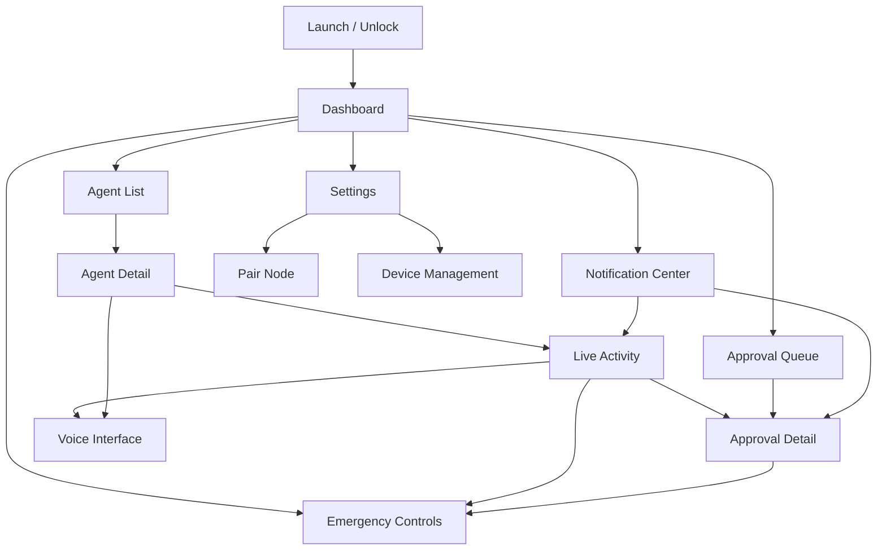

# Mobile UX Architecture

## Purpose

This document defines the mobile app's screen inventory, navigation model, and state contracts. It intentionally avoids UI polish, branding, and visual design details.

## UX Principles

- Every action must preserve visible node, agent, and session context.
- Approval and emergency controls must be reachable without hunting through settings.
- Push notifications deep link to durable gateway state, not transient notification content.
- Live activity must make agent intent legible before the user approves or intervenes.
- Offline/unreachable states must be explicit and must disable unsafe controls.

## Screen Inventory

### Dashboard

Purpose:

- Global operational overview across registered nodes.

Primary content:

- Node health summary
- Active agents
- Pending approvals
- Critical alerts
- Blocked tasks
- Recent completions
- Voice callbacks
- Quarantined agents

Primary actions:

- Open approval queue
- Open node/agent
- Emergency stop for visible active task
- Open notification center

### Agent List

Purpose:

- Browse and filter nodes and agents.

Primary content:

- Node groups by environment
- Agent status
- Active task summary
- Tags and capabilities
- Last seen time

Primary actions:

- Filter by environment/tag/status
- Open agent detail
- Add/register node

### Agent Detail

Purpose:

- Show one agent's state, capabilities, sessions, and controls.

Primary content:

- Node identity
- Agent status
- Current session/task
- Capability list
- Recent sessions
- Approval policy grants
- Audit highlights

Primary actions:

- Start session
- Pause/resume agent
- Quarantine agent
- Open live activity
- Open settings for labels/tags

### Live Activity

Purpose:

- Show what the agent is doing in real time and allow intervention.

Primary content:

- Current plan
- Current tool
- Current target
- Streaming terminal output where available
- Browser state/screenshot where available
- Recent tool history
- Blocked condition
- Pending approval banner

Primary actions:

- Inject instruction
- Pause/freeze
- Cancel task
- Take over browser/session where available
- Emergency stop
- Open approval detail

### Approval Queue

Purpose:

- Triage pending and recent approvals.

Primary content:

- Pending approvals sorted by urgency and expiry
- Risk level
- Node/agent/session context
- Expiry countdown
- Requested tool
- Summary
- State filter: pending, approved, denied, expired, cancelled

Primary actions:

- Open approval detail
- Deny
- Approve with allowed scope
- Pause or terminate related task

### Approval Detail

Purpose:

- Safely review and resolve one approval.

Primary content:

- Node, agent, session, action ID
- Requested tool
- Risk level and category
- Human-readable summary
- Redacted payload
- Resource scope
- Expiration
- Available scopes and controls
- Signature/verification status

Primary actions:

- Approve once
- Approve for this session
- Approve for this agent
- Approve permanent policy exception
- Always deny
- Deny
- Pause agent
- Kill task
- Emergency stop

### Notification Center

Purpose:

- Review mobile notifications and their durable gateway state.

Primary content:

- Notification category
- Urgency
- Related node/agent/session
- Dispatch/open status
- Linked approval/session/audit event

Primary actions:

- Open related approval
- Open session
- Mark read
- Filter by category

### Voice Interface

Purpose:

- Support voice interaction phases.

Primary content:

- Node/agent/session context
- Voice mode status
- Push-to-talk control
- Transcript
- Agent response
- Voice session health
- Approval confirmation prompt when applicable

Primary actions:

- Start voice session
- Push-to-talk
- End voice session
- Interrupt
- Confirm voice approval phrase when supported

### Settings

Purpose:

- Manage app, device, node, and safety configuration.

Primary content:

- Registered nodes
- Registered devices
- Current device identity
- Push notification settings
- Approval defaults
- Voice settings
- Audit export
- Diagnostics

Primary actions:

- Add node
- Revoke device
- Rotate device key
- Rename node/agent
- Configure tags
- Export diagnostics

### Emergency Controls

Purpose:

- Provide fast access to consequential stop controls.

Presentation:

- Available from Dashboard, Agent Detail, Live Activity, and Approval Detail.
- Must always show target node, agent, and session before confirmation.

Controls:

- Pause
- Kill task
- Kill agent
- Quarantine agent

## Navigation Model

## Critical User Flows

### Pair Node

1. User starts pairing on gateway/local Hermes host.
2. Mobile app scans code.
3. App shows node identity and fingerprint.
4. App generates device keypair.
5. Gateway registers device.
6. Dashboard shows new node.

### Resolve Approval From Push

1. User receives push.
2. App opens approval detail.
3. App fetches latest approval state.
4. User reviews node, agent, session, risk, payload, and expiry.
5. User chooses decision/scope.
6. App signs decision.
7. Gateway verifies and updates state.
8. App shows result and audit link.

### Emergency Stop

1. User opens active task context.
2. User taps emergency control.
3. App shows target node, agent, session, and effect.
4. User confirms.
5. App signs intervention.
6. Gateway applies pause/kill/quarantine.
7. App shows resulting state.

### Reconnect After Offline

1. App detects reconnect.
2. App refreshes node inventory and health.
3. App requests event backfill by cursor.
4. App fetches pending approvals.
5. App resolves stale notifications to current state.

## Screen State Contracts

Every actionable screen must know:

- `node_id`
- `node_display_name`
- `agent_id` where applicable
- `agent_display_name` where applicable
- `session_id` where applicable
- connectivity state
- authorization state
- last refreshed time

Approval and emergency screens must additionally know:

- risk level
- risk category
- approval or intervention target
- expiry
- signature readiness
- audit result

## Offline And Unreachable States

| State | UX Behavior |
| --- | --- |
| Mobile offline | Show cached state; disable live actions; queue no approvals |
| Node unreachable | Show last-known state; disable approvals/interventions; allow local settings |
| Event stream disconnected | Show reconnecting state; use REST refresh/backfill |
| Approval expired | Disable approval buttons; allow viewing audit/history |
| Device revoked | Lock app for that node; require re-pairing |

## Accessibility And Safety Notes

- Critical action labels must name the target and effect.
- Countdown timers must not be the only indicator of expiry.
- Voice approval requires confirmation phrase and visible transcript where possible.
- Emergency controls need confirmation but must not be buried.
- Long text payloads should be collapsible and redacted by default.
