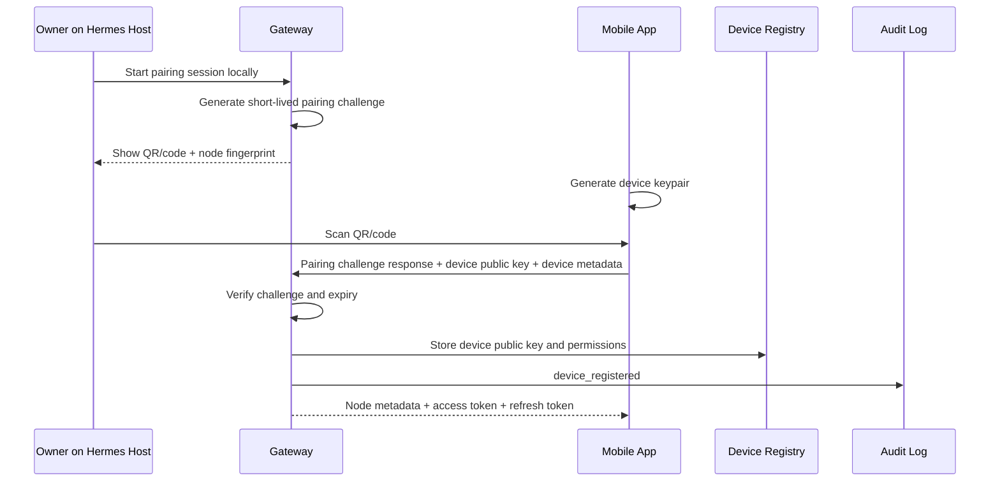

# Authentication And Authorization Design

## Purpose

This design answers how a newly installed mobile app becomes trusted and how trust is maintained, revoked, and extended over time.

Short answer: a new mobile app becomes trusted only through a short-lived local
pairing ceremony with an ACT Gateway. During pairing, the app generates a
device keypair, proves possession of the pairing challenge, registers its public
key with the gateway, and receives node-scoped credentials.

## Identity Model

### Device Identity

Each installed mobile app has a device identity:

- `device_id`
- `device_public_key`
- `device_name`
- `platform`: `ios` or `android`
- `app_instance_id`
- `registered_at`
- `last_seen_at`
- `status`: `active`, `revoked`, `lost`, `rotating`, `disabled`

The private key is generated on device and stored in iOS Keychain or Android Keystore. It must not be exportable through app APIs.

### User Identity

MVP is owner/operator first:

- One implicit owner per gateway.
- Registered devices are trusted operator devices.

Future multi-user support adds:

- `user_id`
- roles
- per-node permissions
- per-agent permissions
- approval limits
- delegated device management

### Node Identity

Each gateway exposes stable node identity:

- `node_id`
- `node_public_key` or gateway fingerprint
- `display_name`
- `gateway_version`
- `hermes_version`
- `created_at`

Mobile app must show node identity and fingerprint during pairing.

## Initial Pairing Flow



Pairing rules:

- Pairing code expires quickly, recommended 5 minutes.
- Pairing can be started only from the Hermes host, trusted local UI, or authenticated gateway admin path.
- Pairing code is single use.
- Pairing must show node fingerprint to the user.
- Pairing stores device public key before any approvals are allowed.

## Device Registration

Registered device record includes:

- Device public key
- Push token hashes
- Platform
- App version
- Permissions
- Last IP/tailnet identity observed
- Created and last-used timestamps
- Revocation status

Device permissions for MVP:

- `read_state`
- `chat`
- `approve`
- `intervene`
- `manage_devices`
- `voice`

## Session Tokens

Session tokens authorize ordinary API access.

Recommended design:

- Short-lived access token, 15 minutes.
- Refresh token or refresh grant bound to device key, 30 days by default.
- Refresh requires proof-of-possession signature from device private key.
- Tokens scoped to one `node_id` and `device_id`.
- Tokens are invalidated on device revocation or key rotation.

Consequential actions do not rely on bearer tokens alone. Approvals and emergency controls require signed request bodies.

## Approval Signing

The mobile app signs approval decisions with the device private key.

Slice 002 uses canonical request signing for sensitive mobile control APIs. The signed string is:

```text
HMCP-SIGN-V1
METHOD
/v1/path?query
unix_timestamp_seconds
nonce
sha256(raw_request_body)
```

Required headers:

- `X-HMCP-Device-Id`
- `X-HMCP-Timestamp`
- `X-HMCP-Nonce`
- `X-HMCP-Signature`

The gateway verifies the registered Ed25519 public key, enforces a 300 second timestamp tolerance, records nonces per device, rejects replay, and audits failures as `auth_signature_failed`.

Signed payload must include:

- `approval_id`
- `action_id`
- `node_id`
- `agent_id`
- `session_id`
- `decision`
- `scope`
- `risk_level`
- `risk_category`
- `payload_hash`
- `expires_at`
- `device_id`
- `signed_at`
- `nonce`

Gateway verification:

- Device is active.
- Token is valid.
- Signature matches registered public key.
- Signed payload matches pending approval.
- Approval is pending and unexpired.
- Decision has not already been processed.
- Scope is allowed for risk category.

## Device Revocation

Revocation paths:

- From another trusted mobile device.
- From local gateway admin interface.
- From command-line/admin flow on Hermes host.
- Future enterprise admin console.

Revocation effects:

- Mark device `revoked`.
- Invalidate access and refresh tokens.
- Delete or disable push tokens.
- Reject future signatures from device.
- Audit `device_revoked`.
- Notify remaining active devices when possible.

Lost device flow:

1. Owner opens gateway admin locally or uses another trusted device.
2. Marks device as lost/revoked.
3. Gateway invalidates sessions and push tokens.
4. Gateway rotates sensitive device registry material if policy requires.

## Multi-Device Support

Multiple devices may be registered to the same node.

Rules:

- Each device has its own keypair.
- Approval decisions record the exact `device_id`.
- Device permissions may differ.
- Notifications may target all active devices or a preferred owner device.
- Concurrent approval responses are resolved by first valid decision unless policy requires quorum in future.

Conflict handling:

- First valid approval/denial wins for `once` approvals.
- Later decisions receive `already_resolved`.
- Emergency controls always apply if still authorized and relevant.

## Multi-User Future Support

Future multi-user support should add:

- Explicit users and roles.
- Role-bound device registration.
- Approval policies by user, role, node, agent, and risk level.
- Optional multi-party approval for critical actions.
- User deactivation independent of device revocation.

Do not optimize MVP for enterprise, but avoid schemas that make users impossible to add later.

## Key Rotation

Device key rotation:

1. Device authenticates with current key.
2. Device generates new keypair.
3. Device submits signed rotation request containing old and new public keys.
4. Gateway marks old key as rotating.
5. Gateway accepts new key and invalidates old refresh grants.
6. Gateway audits `device_key_rotated`.

Gateway key rotation:

- Gateway publishes new fingerprint during maintenance.
- Mobile app requires explicit user confirmation if node fingerprint changes unexpectedly.
- Old gateway key can sign a rotation statement if available.

## Recovery Process

If all devices are lost:

1. Owner accesses Hermes host locally.
2. Owner starts recovery pairing flow.
3. Gateway requires local admin proof, such as local shell access or configured admin secret.
4. Gateway can revoke all devices.
5. Owner pairs a new device.
6. Recovery event is audit logged.

Recovery must not be possible through unauthenticated remote access.

## Authorization Matrix

| Action | `read_state` | `chat` | `approve` | `intervene` | `manage_devices` | `voice` |
| --- | --- | --- | --- | --- | --- | --- |
| View dashboard | required | | | | | |
| View live activity | required | | | | | |
| Send chat | required | required | | | | |
| Fetch approval detail | required | | required | | | |
| Approve/deny | required | | required | | | |
| Pause/kill/quarantine | required | | | required | | |
| Create TUI session | required | | | required | | |
| Detach/close TUI session | required | | | required | | |
| Register push token | required | | | | | |
| Revoke device | required | | | | required | |
| Start voice session | required | | | | | required |

## Route Protection Matrix

| Route Group | Protection |
| --- | --- |
| `/v1/pairing/start`, `/v1/pairing/complete` | Pairing bootstrap; unauthenticated but short-lived and locally initiated |
| `/v1/events/stream` | Paired device access token |
| `/v1/tui/sessions` REST controls | Canonical Ed25519 signed device request |
| `/v1/tui/sessions/{session_id}/stream` | Paired device access token after signed session creation |
| Approval decisions and interventions | Canonical Ed25519 signed device request |
| Hermes-local tools | Loopback or explicit caller allowlist |

## Hermes-Local Binding Controls

Slice 003 separates Hermes-local tool calls from mobile control calls.

Hermes-local endpoints, including node registration, `mobile_notify`, `approval_requested`, and `approval_status`, are accepted only from loopback callers by default:

- `127.0.0.1`
- `::1`
- `localhost`

If Hermes and the gateway are intentionally split across private infrastructure, the gateway can allow exact caller addresses through `HERMES_ALLOWED_HERMES_CALLERS` or `HERMES_GATEWAY_ALLOWED_HERMES_CALLERS`.

Non-loopback, non-allowlisted Hermes-local calls fail closed with `403` and create `hermes_local_request_rejected` audit events. Mobile-facing reads and approval decisions continue to require signed device requests.

## Security Defaults

- Pairing disabled unless explicitly started.
- Approval and intervention require device signatures.
- Access tokens are short-lived.
- Device revocation is immediate.
- Critical actions require user-visible confirmation.
- Push tokens are never sufficient for API access.
- Tailscale identity is a network signal, not authorization by itself.
